# Présentation du cours

## Objectifs du cours

-   Définir les émotions
-   Comprendre comment les émotions influencent les processus cognitifs (attention/mémoire/raisonnement)
-   Comprendre comment les processus cognitifs peuvent moduler les expériences émotionnelles (régulation émotionnelle)
-   Examiner les différences individuelles dans ces processus et les interactions

## Répartition des tâches

Cours :

‒ Apporter des connaissances générales et méthodologiques sur l’étude des relations entre émotion et cognition

Étudiant.e :

‒ Mettre en relation ces connaissances et un champ de recherche à choisir (e.g., vieillissement, apprentissages, développement de l’enfant, orientation) 

## Évaluation du cours 

‒ Sujet type cadre théorique dans une réponse à un AAP/ abstract (sans les résultats) en un nombre de mots donné

[exemple p.31](https://jipd-2018.sciencesconf.org/data/pages/Organisation_Horaires_23e_Journees_Internationales_de_Psychologie_Differentielle.pdf) 

‒ Critères de réussite : 

    - Sélection et mise en lien de notions apprises en cours 
    - Fluidité et lisibilité de la rédaction 
    - Apports de sa recherche personnelle sur le sujet (lectures complémentaires)

::: notes
éviter les catalogues, juxtaposition, récitation de cours
:::

## Source Principale

‒	Lemaire, P. (2021). *Émotion et cognition: Série LMD*. De Boeck Supérieur.

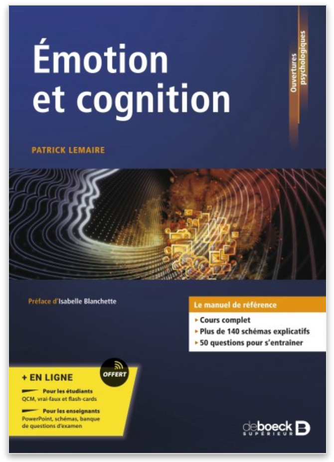
## Plan de la première partie du cours

**Introduction**
=> Quelles questions en psychologie sur le lien entre émotion et cognition ? 

**Définition des émotions**
=> Modèles théoriques

**Comment étudier le lien entre émotion et cognition ?** 
=> Que cherche-t-on ?
=> Induire l'émotion ou utiliser ses occurences naturelles
=> Induire l'émotion en dehors de la tâche ou par la tâche (incidentes vs. intégrales)

::: notes 
revenir sur cette diapo en début de cours
:::

# Introduction

## Les émotions dans nos vies

Rôle central

- Actions
- Pensées 
- Relations 

=> guident nos actions au quotidien

::: notes
«Elles interviennent dans nos actions, nos pensées et nos relations. Elles nous aident à détecter et repérer ce qui est important, à mémoriser, à comprendre et à décider. Elles guident nos actions au quotidien.»
:::

## Les émotions dans la recherche

‒	Sciences cognitives et affectives

•	Psychologie

•	Linguistique

•	Philosophie

•	Sociologie

•	Anthropologie

•	Informatique

•	Psychiatrie 

‒	Depuis les années 80

::: notes
Parce qu’elles sont centrales, elles sont étudiées par différentes disciplines.
Exemples : 
- Informatique : IA
:::

## Les émotions dans la recherche
	
Actes du colloque « Émotions et science : interactions », université de Nice (2020)

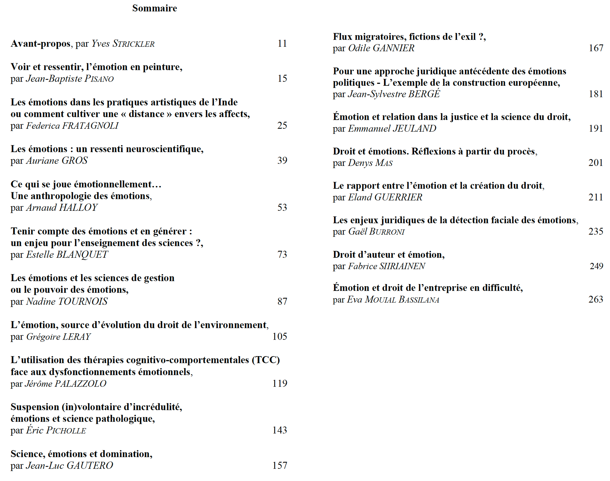

## Quelles questions peuvent-elles se poser dans la recherche ? 

[lien Wooclap](https://app.wooclap.com/events/YNCKQT/live-session)

ou wooclap.com, code YNCKQT

## Exemples de questions actuelles en psychologie des émotions {.scrollable}

‒	Comment sait-on si quelqu’un éprouve une émotion ? Comment sait-on quelle émotion il éprouve ? Qu’est-ce qu’une émotion ?

‒	Combien d’émotions fondamentales de base différentes existe-t-il ? Quelles sont-elles ? Comment faisons-nous pour distinguer entre plusieurs émotions ?

‒	Qu’est-ce qu’une émotion forte (ou intense) vs. une émotion moins forte ? 

‒	Les émotions sont-elles universelles et innées (et présentes dans toutes les cultures)  ou varient-elles selon la culture ? Idem pour l’expression des émotions ?

‒	Les femmes sont-elles plus émotionnelles que les hommes ? Les personnes jeunes ont-elles plus d’émotions, des émotions plus intenses que les âgés? Les émotions évoluent-elles au cours de la vie ? Certains individus sont-ils plus émotionnels que d’autres ? Comment le savoir ?

‒	Les animaux ont-ils des émotions ?

‒	Nos émotions sont-elles différentes lorsque nous sommes seuls à vivre un événement émotionnel et lorsque nous sommes avec un autre ou avec d’autres ?

‒	Comment formulons-nous nos jugements (discrimination, détermination, identification) émotionnels ?

‒	A quoi servent les émotions ? Pourrions-nous vivre sans émotion? 

‒	Comment les émotionsinfluencent-elles nos performances cognitives?

::: notes
Voici quelques grandes questions posées par la psychologie des émotions.
Grâce à toutes ces questions, on comprend mieux ce que sont nos émotions, quand nous éprouvons des émotions et ce qui les déclenche, pourquoi nous avons des émotions, et l’impact des émotions sur la cognition.
:::

## Temps de réflexion personnel et questions

Dans quel champ aimeriez-vous réfléchir à la question du lien entre émotion et cognition ? 

Quels sont vos questionnements de chercheurs a priori ? 

::: notes
prendre le temps d'y réfléchir, de se poser des questions, qui serviront de base à la réflexion
:::

Si vous avez envie de partager vos questions : [lien Wooclap](https://app.wooclap.com/events/YNCKQT/live-session)

# Partie 1 - Émotions : définition et méthodologie expérimentale

À comprendre dans cette partie de cours : 

‒	Ce qu’est une émotion 

‒	Comment étudier les émotions  

‒	Comment, du point de vue méthodologique, étudier l’impact des émotions sur la cognition 

# Définition des émotions

## Qu’est-ce qu’une émotion ?

*Chacun sait ce qu’est une émotion jusqu’à ce qu’on lui demande d’en donner une définition.* 
*À ce moment-là, il semble que plus personne ne le sache.*

Fehr & Russell (1984)

::: notes
Années 80, grand essor des questions scientifiques sur les émotions
:::

## Émotions : définitions {.scrollable}

Multiples définitions mais points communs

‒	États internes observables ou non (comportements, expressions verbales ou faciales)

‒	S’accompagnent de réactions physiologiques (changement de fréquence cardiaque, transpiration, contraction des muscles …)

‒	Réponses psychologiques et/ou physiologiques d’intensité, de durée, de complexité variables à une situation 

‒	Plusieurs types d’émotions

## Émotions : définition

«Patrons biologiquement fondés de perception, d’expérience, de physiologie, d’action et de communication, caractérisés par leur aspect épisodique, de courte durée, et qui se produisent en réponse à des défis et opportunités physiques et sociaux spécifiques.» 
	
	(Keltner & Gross, 1999, p.468)
	
## Qu’est-ce qu’une émotion ?

‒	Un ensemble de réponses, d’intensité, de durée et de complexité variables qui s’expriment de manière plus ou moins publique/privée

‒	Différent de l’humeur ou des sentiments

‒	Terme chapeau « affects » :

    - Émotions (e.g., colère, tristesse)
    - Réponse au stress
    - Humeur (dépression, euphorie) 
 
::: notes
Humeur : durable 
Sentiment : durée longue, construction consciente, vient d’une évaluation subjective (pas en réaction comme l’émotion)
Stress: pas sentiment, ni émotion, mais réaction physiologique et psychique à l’environnement. Concepts distingués mais liés (différences physiologiques dans le traitement)
:::

## Différences entre émotion et autres affects

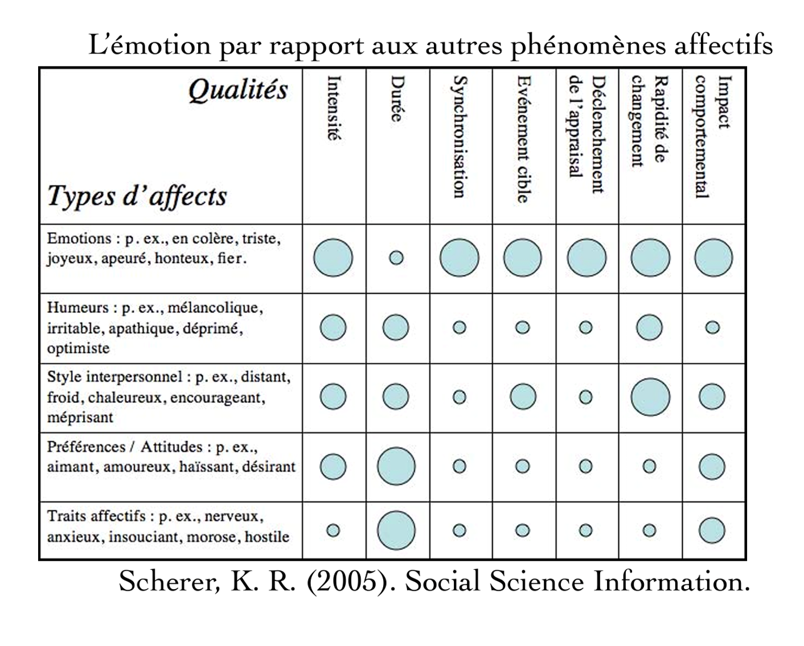

::: notes
Synchronisation : l’émotion est synchronisée avec un événement (ou le fait d’y penser) 
Appraisal : évaluation cognitive

FIN S1
:::

## Caractéristiques d’une émotion {.scrollable}

Quand l’émotion survient-elle ?

- Nos émotions dépendent de la situation (évaluation cognitive), mais pas uniquement

- Elles dépendent aussi de notre interprétation de la situation => **Théorie de la ré-évaluation cognitive** (Laarus, 1991; Scherer, Schorr & Johnstone, 2001)

- notre évaluation mentale de la situation :

    - sens de la situation pour nous (ce qu'elle signifie)
    - aide ou menace pour nos objectifs
    - est-ce qu'on se sent capable d'y faire face ? 

    
  provoque les émotions 
  
- La ré-évaluation cognitive permet de changer volontairement son interprétation de la situation pour modifier l'émotion ressentie

::: notes
Appraisal theory

Exemples
- Un étudiant reçoit une mauvaise note.

Évaluation initiale : « Je suis nul, je vais échouer » → tristesse, découragement.

Ré-évaluation : « C’est un indicateur de ce que je dois travailler » → motivation, espoir.

- Une personne parle en public et voit quelqu’un froncer les sourcils.

Évaluation initiale : « Il me juge négativement » → anxiété.

Ré-évaluation : « Il est peut-être juste concentré ou fatigué » → diminution du stress

Ré-évaluation cognitive : mécanisme de régulation émotionnelle, on en reparlera quand on traitera ce point
:::

## Caractéristiques d’une émotion 

Nature multi-dimensionnelle

- Émotion : multitude de réactions, plus ou moins synchronisées ; réactions physiologiques, subjectives (vécu, ressenti), comportementales et sociales

## Le modèle modal de l’émotion

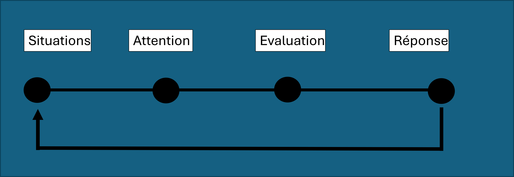
*Barrett et al., 2007; Gross, 1998*

::: notes
Une émotion survient lorsque nous nous trouvons dans une situation ou face à un stimulus, après évaluation (du caractère dangereux ou pas, ou du caractère agréable/désagréable).
On porte plus ou moins attention à certains aspects de la situation. On donne un sens à ce que l'on perçoit (évaluation). Puis réponse émotionnelle. L’émotion peut s’exprimer à différents niveaux (depuis les niveaux physiologiques comme l’accélération du rythme cardiaque) jusqu’aux niveaux psychologiques et comportementaux (comme un ressenti de peur et une fuite). 
:::

## Le modèle modal de l’émotion

- Processus dynamique en plusieurs étapes (!= d'un réflexe automatique)
- montre où et comment peut intervenir la régulation émotionnelle

    - changer la situation
    - changer l'attention que l'on y prête
    - réévaluer la situation
    - après le déclenchement de l'émotion : contrôler la respiration, l'expression

::: notes
ex
Une personne doit passer un entretien d’embauche/master.

Situation : entretien imminent.

Attention : elle se concentre sur ses erreurs passées.

Évaluation : « Je vais rater. »

Réponse : anxiété, mains moites.

Régulation possible :

Avant : se focaliser sur ses réussites (attention).

Pendant : reformuler mentalement (« c’est une opportunité »).

Après : respiration lente pour réduire la tension.

ou ex d'un conducteur qui se fait couper la route
:::

## Taxonomie des émotions

‒	Toujours en questionnement dans la littérature (Eckman, 1984; Averill, 1980; Scherer, 1984), voir Gross & Barrett (2011)

‒	Émotions de base

    - joie, surprise, 
    - colère, tristesse, dégoût, peur
    
‒	Émotions réflexives 

    - jalousie, envie (émotions comparatives)
    - honte, culpabilité, embarras, fierté, orgueil (émotions d'auto-évaluation)
    
::: notes
Comment classer les émotions ? Ex de questionnement. Basic 6 en questionnement (parfois 7 quand on ajoute le mépris). Ex : Keltner et al. 2021 proposent une taxonomie avec davantage d'émotions positives. Émotions de base universelles ou non ? Questionne l’existence d’une «base» à proprement parler
Eckman (1984) : uniquement des émotions de base et elles sont universelles. Perspective universaliste
Averill (1980) : culturel et nécessité d’étudier d’autres émotions (ex: culpabilité). Pas de correspondance parfaite entre les cultures. Le fait qu’une émotion est fondamentale dépend de la culture :ex du «liget» chez les Ilongots (chasseurs de tête des Philippines (caractère agressif exaltant et grisant lorsqu’une tête d’une autre ethnie est tranchée). Ou le hygge en danois
Scherer (1984) : approche intégrée. Ce n’est pas parce que des mots différents sont utilisés qu’il ne s’agit pas des mêmes émotions, mais on observe tout de même des différences culturelles.
:::

## Deux dimensions pour caractériser les émotions

‒	La valence : de négative à positive

‒	L’intensité : de faible à forte

Valence

::: notes
valence : continuum plaisant/déplaisant
:::

## Exercice : Valence et intensité émotionnelles

5 questions

[lien Wooclap](https://app.wooclap.com/events/YNCKQT/live-session)

## Émotions de base : quels déclencheurs ? Quels signes ?

‒	Différences inter-individuelles mais les expressions psychologiques, comportementales et physiologiques des émotions présentent un profil général dans le développement typique

::: notes
Profil général mais différences. Par ex :
 - TSA : réactions physiologiques (électrodermales/ pupillaires) préservées ou amoindries selon les études, cardiaques similaires ((2) Lydon, S. et al. (2016) Dev. Neurorehabilitation 19, 335–355 ; (3) Aguillon-Hernandez, N. et al. (2020) J. Child Psychol. Psychiatry 61, 768–778).
Expressions comportementales des émotions différentes :  Briot, K., Pizano, A., Bouvard, M., & Amestoy, A. (2021). New technologies as promising tools for assessing facial emotion expressions impairments in ASD: A systematic review. Frontiers in Psychiatry, 12, 634756.
Faire une heure sur émotion et cognition dans le développement atypique ? 

:::

## Déclencheurs {.scrollable}

- Colère 

    - Face à un obstacle
    - Quand un besoin n’est pas satisfait
    

- Tristesse

    - Situation de manque, d’absence
    - Quand nous n’obtenons pas ce que nous voulons, obtenons ce que nous ne voulons pas
    
- Joie

    - Réussite
    - Satisfaction d’un ou plusieurs de nos besoins (précis)

## Expressions faciales {.scrollable}

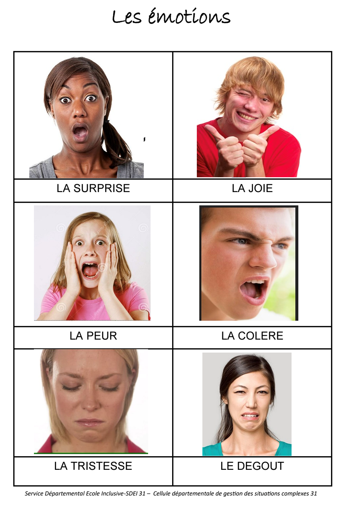

## Changements physiologiques (Levenson et al., 1990) {.scrollable}

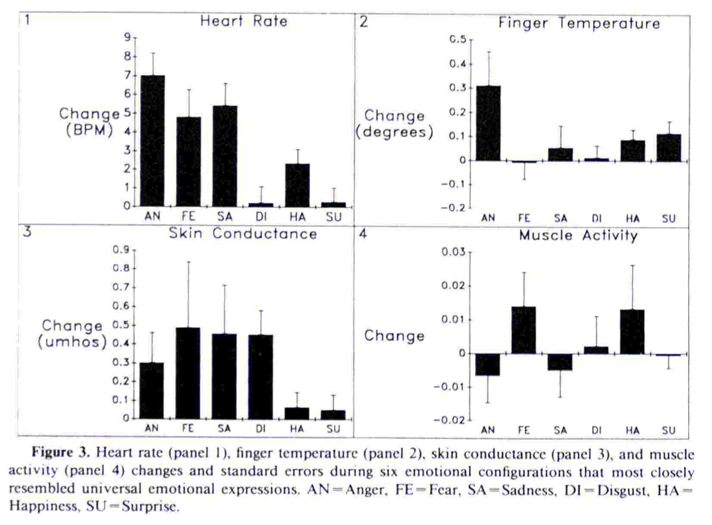

::: notes
fin S2
:::

## Recherche : que cherche-t-on à élucider ? 

Questions déclinables pour chaque fonction cognitive

- Les émotions affectent-elles nos performances ? 
- Si oui, dans quelles conditions ?
- Dans quel sens et dans quelles proportions ?
- Par quels mécanismes ?

# Comment étudier le lien entre émotions et cognition ?

## Principes méthodologiques généraux de l'étude du lien émotion/cognition {.scrollable}

- Réalisation d’une tâche cognitive connue

    - Ex : tâche de raisonnement, de rappel

- Dans une condition :

    - Émotionnelle/neutre
    - En inter ou en intra (si possible) 
    
- Comparaison  des performances en fonction de l’état émotionnel du participant

    - Déterminer si les mécanismes connus pour la tâche cognitive sont mis en œuvre différemment en condition émotionnelle et en condition neutre

::: notes
Mécanismes connus par les chercheurs pour pouvoir comprendre le changement potentiellement observé lorsqu’on introduit l’émotion

Exemple d’étude : est-ce que les émotions influencent une tâche de recherche visuelle Fox et al. (2007)
:::

## Exemple  - Émotion et recherche visuelle {.scrollable}

Fox et al. (2007)

- Photos du IAPS : pistolets, serpents, fleurs et champignons

    *images réelles dans l'expérimentation, les figures du diapo sont des illustrations*
    
- Consigne : Trouver si toutes les images sont les mêmes ou non dans chaque set 

Que mesure-t-on ? Pourquoi ? [lien Wooclap](https://app.wooclap.com/events/YNCKQT/live-session)

::: notes
International Affective Picture System/ image proposée pour mieux comprendre mais la vraie expé s’est faite à partir de photos et non de dessins, ce qui change au niveau méthodo. Images IAPS non disponibles car choix de garder la primeur des images pour les expés des créateurs. Autres bases (OASIS par ex) sont ouvertes.
50% des sets contiennent les mêmes images, 50% des sets contiennent un intrus
Pas de différence significative sur les erreurs, mais différences sur les temps de réaction
:::

##  Exemple  - Émotion et recherche visuelle (Fox et al., 2007)

Résultats

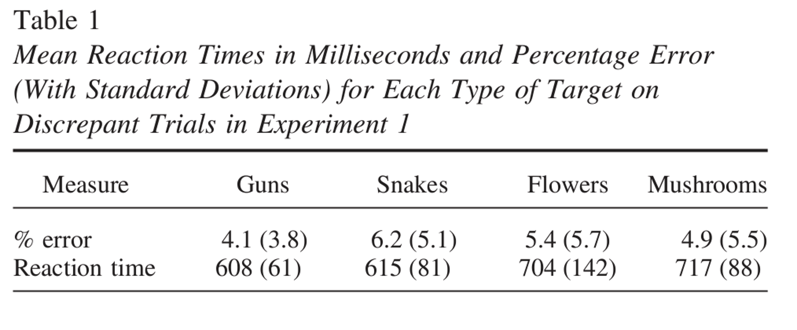

::: notes
International Affective Picture System/ image proposée pour mieux comprendre mais la vraie expé s’est faite à partir de photos et non de dessins, ce qui change au niveau méthodo. Images IAPS non disponibles car choix de garder la primeur des images pour les expés des créateurs. Autres bases (OASIS par ex) sont ouvertes.
50% des sets contiennent les mêmes images, 50% des sets contiennent un intrus
Pas de différence significative sur les erreurs, mais différences sur les temps de réaction
:::

## Méthodologies pour l'étude des émotions

Manipulations expérimentales => induction

Occurrences naturelles

## Manipulations expérimentales (induction)

- Stimuli émotionnels (images ou mots à valence émotionnelle; revue Kenealy, 1986 pour des mots; images IAPS, Lang, Bradley, & Cuthbert, 2005 ; NAPS ; OASIS)

::: notes
Remarque : une critique adressée à la banque d’image IAPS c’est qu’elle a été utilisée et testée quasi uniquement dans le minority world (aussi appelé WEIRD pour White Educated Industrialized Rich Democratic)
D’autres bases (en open access) ont été créées depuis : https://imotions.com/blog/learning/research-fundamentals/iaps-international-affective-picture-system/
Nencki Affective Picture System (NAPS)This database “consists of 1,356 realistic, high-quality photographs that are divided into five categories (people, faces, animals, objects, and landscapes)” and has been rated for both valence and arousal, as IAPS was, but with a measurement of “approach-avoidance” rather than dominance / control. The database also provides measurements of physical properties of the photographs – the luminance, contrast, and entropy, which can be important when these need to be controlled for (such as with pupillometry).Subsets of the database have also been formed to provide data that has been more intensively categorized, such as for discrete emotional categories, erotic content, and fear inducing material.
Open Affective Standardized Image Set (OASIS)OASIS is an “open-access online stimulus set containing 900 color images depicting a broad spectrum of themes, including humans, animals, objects, and scenes, along with normative ratings on two affective dimensions – valence… and arousal”. The database is also “not subject to the copyright restrictions that apply to the International Affective Picture System” which opens up the possibilities for use.
Geneva affective picture database (GAPED)GAPED is a database consisting of 730 photos, “rated according to valence, arousal, and the congruence of the represented scene with internal (moral) and external (legal) norms”. The negatively-valenced photos include “spiders, snakes, and scenes that induce emotions related to the violation of moral and legal norms”, while the positively-valenced photos include “mainly human and animal babies as well as nature sceneries”. Neutral pictures primarily show inanimate objects.
Emotional Picture Set (EmoPicS)As research into emotions often requires a large number of stimulus presentations, EmoPicS has been built to add to the material available. The database “comprises a total of 378 standardized color photographs with different semantic content (diverse social situations, animals and plants) as well as different emotional intensity and valence”. The database is only available for academic research or clinical work.
EmoMadridEmoMadrid is a database of over 800 photos with different affectiva content. The data includes information about the “affective valence, arousal, spatial frequency, luminosity and physical complexity”.
Military Affective Picture System (MAPS)MAPS is an image database that “provides pictures normed for both civilian and military populations to be used in research on the processing of emotionally-relevant scenes common among military populations”. It consists of “240 images depicting scenes common among military populations”. The data was scored in the same way as IAPS, with measures of valence, arousal, and dominance.
Development and Validation of the Image Stimuli for Emotion Elicitation (ISEE)The ISEE was built as a “set of reliable pictorial stimuli, which elicited target emotions stably over time”. The ISEE, in comparison to IAPS, GAPED, and others, has been tested for stability in emotional elicitation over repeated presentations. The database consists of 356 photos, selected from an initial pool of over 10,000.
Open Library of Affective Foods (OLAF)OLAF as a database of images “has the specific purpose of studying emotions toward food” and “depicts high-calorie sweet and savory foods and low-calorie fruits and vegetables, portraying foods within natural scenes matching the IAPS features”. The images are available to be downloaded directly from the website.
DIsgust-RelaTed-Images (DIRTI)Built specifically for eliciting feelings of disgust, the DIRTI database “consists of 240 disgust-inducing pictures divided into six categories (food, animals, body products, injuries/infections, death, and hygiene)” as well as 60 neutral pictures. The photos were rated on scales measuring disgust, fear, valence, and arousal and can be downloaded directly through the link above
:::

## Manipulations expérimentales (induction) - bases d'images

Exemple : OASIS

[lien OASIS](https://www.benedekkurdi.com/%23oasis) 

- 900 images
- échelle en deux dimensions : valence/ intensité

## Manipulations expérimentales (induction) - OASIS {.scrollable}

- Kurdi, B., Lozano, S., & Banaji, M. R. (2017). Introducing the Open Affective Standardized Image Set (OASIS). Behavior Research Methods, 49(2), 457–470. https://doi.org/10.3758/s13428-016-0715-3

- Pas d’effet de genre (une fois enlevées les images -18 explicites)

- Effets négligeables de 

    - l’âge, 
    - des revenus,
    - l’orientation politique (sauf -18 et violence)

::: notes
Corrélations entre valence homme/femme et intensité homme/femme très fortes. Si on regarde le tableau des valences et intensité moyennes, on voit des différences entre hommes et femmes, mais la corrélation est très forte (à plus de .92). 
Fin S2 ?

https://www.benedekkurdi.com/#!portfolio/project-4.html
https://db.tt/yYTZYCga / 
:::

## Méthodologies pour l’étude des émotions - induction {.scrollable}

1/ Manipulations expérimentales (induction)

- Films (revue Gross & Levenson, 1995)

    - Ex: « Psychose », « le cercle des poètes disparus » 

## Méthodologies pour l’étude des émotions - induction

1/ Manipulations expérimentales (induction)

- Odeurs (e.g., banane/œuf pourri dans Billot et al., 2017)
- Musiques (allegro: joyeux; adagio: tristes; revue Västfjäll, 2002)
- Réactivation de souvenirs émotionnels (e.g. Lerner & Keltner, 2001)
- Induction de stress ou feedbacks d’échecs (e.g., the Trier Social Stress Test; Kirsch- baum, Pirke, & Hellhammer, 1993).

::: notes
Banane/œuf pourri : l’une de ces odeurs est plaisante

Ex de réactivation de souvenirs émotionnels : essayez de vous souvenir du premier jour où vous êtes allés à l’école, de retrouver un événement heureux, un événement triste dans votre mémoire

Trier Social Stress Test : pour induire du stress. 1/ préparer une présentation pour un entretien d’embauche en mettant en avant ses qualités personnelles– durée de préparation : 2 minutes
2/ Donner cette présentation pendant 5 minutes devant deux évaluateurs en blouse blanche. Le participant est filmé. 
3/ pendant 5 minutes, compter à rebours. Ex: compter par pas de 17 en partant de 2043.

Allegro concerto en mi majeur Bach
Adagio Albinoni
Sometimes it snows in April – Prince
:::

## Méthodologies pour l’étude des émotions - occurrences {.scrollable}

2/ pas de manipulation expérimentale – utilisation des occurrences naturelles

- Journal (diary)
- Différences inter individuelles (pathologies, phobies, anxiété chronique)
- Évaluation par des questionnaires (DES, BMIS, PANAS, CMQ, EPI)

    - Utilisés pour évaluer l’état émotionnel du participant arrivant au labo

    - Et/ou pour vérifier l’état émotionnel après induction

::: notes
1/On demande au participant de tenir un journal quotidiennement ou de façon hebdomadaire pendant une certaine période et d’y noter toutes les émotions vécues, tous les événements ou réflexion qui ont déclenché des émotions + caractéristiques des émotions
2/Le chercheur utilise le journal pour, par exemple, poser des questions au participant et voir s’il se souvient mieux de certains événements en fonction de de leur valence et intensité émotionnelles.

On peut utiliser les différences inter individuelles et la présence de pathologies phobiques ou d’anxiété pour comparer les performances avec des sujets contrôles ou avec la littérature existante.
:::

## Méthodologies pour l’étude des émotions

Questionnaires d’évaluation émotionnelle 

‒	DES : Differential Emotions Scale ou Echelle Différentielle d’émotions (Izard et al., 1974)

‒	BMIS : Brief Mood Introspection Scale (Mayer & Gaschke, 1988)

‒	PANAS Positive and Negative Affect Schedule – Echelle d’Affectivité Positive et Négative (Watson, Clark & Tellegen, 1988)

‒	CMQ : Current Mood Questionnaire, Questionnaire d’humeur du moment (Feldman, Barrett, & Russell, 1998)

‒	EPI : Emotional Profile Index (1988)

## PANAS: Exemples d’items

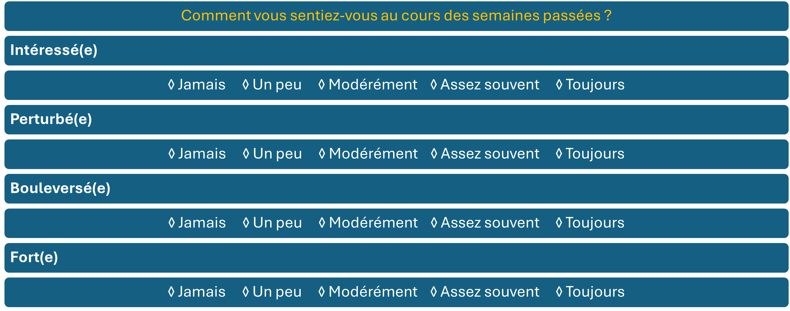

## Différencier l’émotion liée à la tâche cognitive de l’émotion sans rapport avec la tâche

- Différence entre 

    - Induction émotionnelle => émotion en dehors de la tâche
    - Manipulation de la valence émotionnelle des stimuli => émotion produite par la tâche 
    
- On parle d’émotions **incidentes** versus **intégrales**

::: notes
On peut penser que l’effet des émotions pourra être différent selon qu’on fait une induction émotionnelle (film, musique, odeur …) ou qu’on manipule la valence émotionnelle des stimuli
:::

## Émotions incidentes 

- Provoquées/induites par une situation indépendante de la tâche réalisée et des stimuli à traiter 
- Source des émotions : exogène à la tâche à accomplir
- Technique d’étude : méthodes d’induction (film, faire remémorer des souvenirs, récits … avant la tâche)

## Émotions intégrales

- Provoquées/déclenchées par la tâche et/ou les stimuli à traiter pour réaliser la tâche
- Source des émotions : endogène à la tâche à accomplir
- Technique d’étude : manipuler le contenu émotionnel des stimuli à traiter (ex: énoncés émotionnels dans une tâche de raisonnement, chronomètre dans une tâche arithmétique)

## Exemple en cognition numérique 

Lemaire, P. (2022). Emotions and arithmetic in children. *Scientific Reports, 12*(1), 20702. https://doi.org/10.1038/s41598-022-24995-9

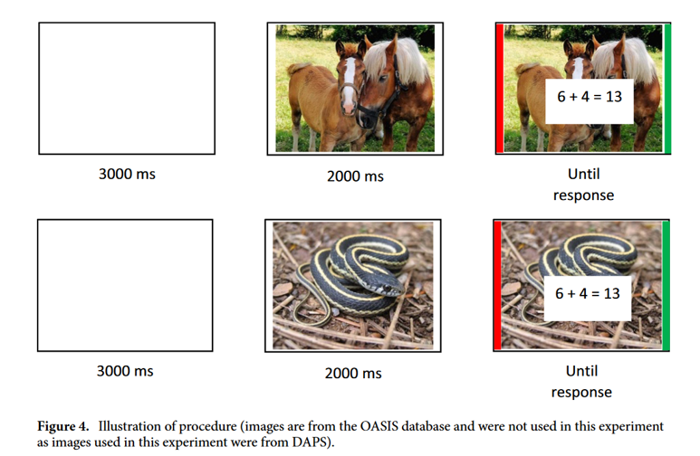

::: notes
96 problems, 12 (individual problems) × 2 (versions: a + b, b + a) × 2 (true, false)× 2 (negative, neutral emotions)
:::

## Lemaire (2022) - Résultats

‒	Performances + faibles dans la condition émotion négative pour tous les groupes d’âge (RT + long)

‒	Effet délétère + important des émotions négatives sur les problèmes + difficiles (TRUE vs. FALSE)

‒	Baisse de l’effet des émotions avec l’âge de l’enfant

‒	Effet maximum de l’émotion sur les problèmes posés juste après le stimulus émotionnel

::: notes
More specifically, 8–15 year-old participants (N = 207) solved arithmetic problems (8 + 4 = 13. True? False?) that were displayed superimposed on emotionally negative or neutral pictures. The main results showed (a) poorer performance in emotionally negative conditions in all age groups, (b) larger deleterious effects of negative emotions on harder problems, (c) decreased effects of emotions as children grow older, and (d) sequential carry-over effects of emotions in all age groups such that larger decreased performance under emotion condition relative to neutral condition occurred on current trials immediately preceded by emotional trials. These findings have important implications for furthering our understanding of how emotions influence arithmetic performance in children and how this influence changes during childhood
:::

## Lemaire (2022)

‒	Effet de médiation 

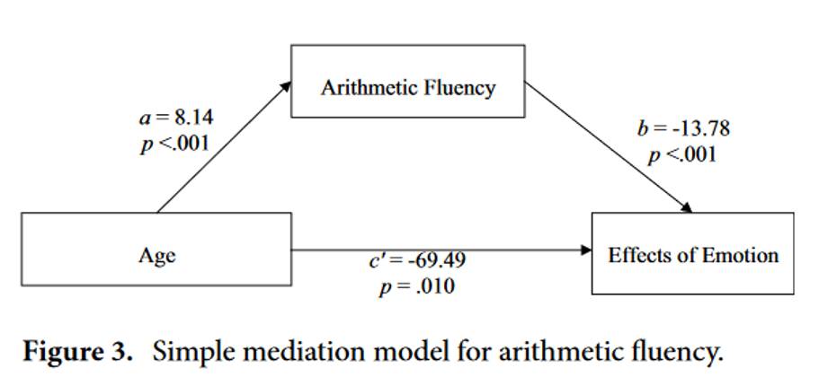

::: notes
Médiation mais âge est aussi un prédicteur unique de l’effet de l’émotion.
We tested whether arithmetic fluency mediated age-related changes in how emotions influence arithmetic performance. A simple mediation analysis on emotion effects (differences in latencies between emotion and neutral conditions) was carried out. Using the Medmod 1.1.0 module for JAMOVI (10,000 boostrapped resamples; Model 449), we regressed emotion effects on age (coded in years) and entered arithmetic fluency as the mediator. As can be seen in Fig. 3, arithmetic fluency increased with increasing age (a = − 8.14), and the higher arithmetic fluency the smaller the effects of emotions (b = − 13.78). The confidence interval of the indirect effect through arithmetic fluency did not include zero (ab = − 112.30; CI 95% (− 169.00 to − 66.60). Arithmetic fluency was thus a significant mediator that accounted for 61.8% of the total age-related changes in effects of emotion on children’s arithmetic performance. Note however that age had a unique influence on emotional effects (cʹ = − 69.49, p = 0.010).
:::

## Lemaire (2022)

Conclusions 

- La fluence arithmétique est un facteur médiateur de la relation entre l'âge et les effets de l'émotion 
- Mais l'âge reste un prédicteur des effets de l'émotion au-delà de la fluence arithmétique

::: notes
Médiation mais âge est aussi un prédicteur unique de l’effet de l’émotion.
We tested whether arithmetic fluency mediated age-related changes in how emotions influence arithmetic performance. A simple mediation analysis on emotion effects (differences in latencies between emotion and neutral conditions) was carried out. Using the Medmod 1.1.0 module for JAMOVI (10,000 boostrapped resamples; Model 449), we regressed emotion effects on age (coded in years) and entered arithmetic fluency as the mediator. As can be seen in Fig. 3, arithmetic fluency increased with increasing age (a = − 8.14), and the higher arithmetic fluency the smaller the effects of emotions (b = − 13.78). The confidence interval of the indirect effect through arithmetic fluency did not include zero (ab = − 112.30; CI 95% (− 169.00 to − 66.60). Arithmetic fluency was thus a significant mediator that accounted for 61.8% of the total age-related changes in effects of emotion on children’s arithmetic performance. Note however that age had a unique influence on emotional effects (cʹ = − 69.49, p = 0.010).
:::

## Pour résumer 

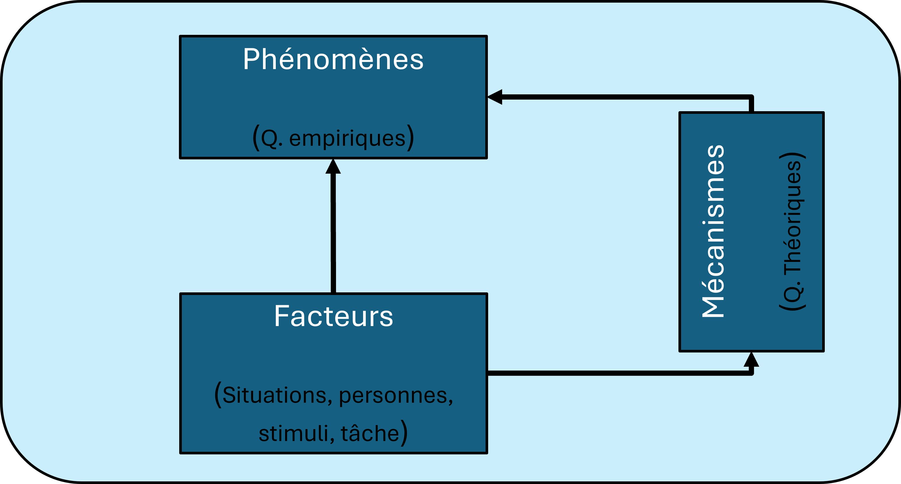 

# Partie 2 - Émotion et attention

## Attention 

Attention intervient à toutes les étapes du traitement de l’information

- Sélection d’informations utiles (en fonction du but)
- Sélection du traitement à appliquer
- Mise en œuvre du traitement : transformation de l’information
- Transmettre une réponse

::: notes
exemples : 
1/ sélection infos : en classe, si le but est de mémoriser le plus d'éléments possibles, l'attention va servir à se focaliser sur le cours et à ignorer les conversations autour
En conduite, on se concentre sur les feux et les piétons plutôt que sur les vitrines 
En résolution de pb de maths, on repère les nombres et la question et on ignore les détails narratifs inutiles
2/ Sélection traitement : en maths, devant 7+8 on peut choisir différentes stratégies
3/ mise en oeuvre du traitement : l'attention sert au maintien et à la manipulation de l'information pendant le traitement. Elle soutient la mémoire de travail et les opérations mentales. Ex : 23+19 (garder 23 en mémoire, ne pas oublier la retenue)
4/ transmission réponse : attention intervient pour produire la réponse et inhiber les réponses inadaptées. Ex : lever la main avant de parler en classe, stroop (dire la couleur de l'encre et non lire le mot)
:::

## Fonctions de l'attention {.scrollable}

- Différents mécanismes dans l’attention
- Attention soutenue 

    - Concentration prolongée
    - Focaliser son attention longtemps sur une information cible
    - Commence à décliner vers 30 ans
    
- Attention sélective

    - Sélectionner un stimulus pertinent pour accomplir une tâche
    - Focus sur un ou plusieurs aspects importants (stimulus, information, situation)
    - Commence à décliner vers 40 ans
    
::: notes
Chacune des fonctions intervient dans des contextes différents, est étudiée avec des tâches spécifiques, est influencée par des facteurs communs ou différents et évolue avec l’âge et la psychopathologie de manière différente.

A chaque fois, c’est la capacité à … Sélectionner un stim …
L’attention soutenue est difficile à étudier parce qu’on ne peut pas utiliser de tâche simple (il faut plusieurs épreuves, avec des demandes cognitives différentes).
Ex 1 Attention sélective : on la mesure avec des tâches de conflit (exemple la tâche de Stroop), de Go/No go (quand tape une fois du poing dans la main, faire pareil et quand tape 2 fois, ne pas le faire, quand on tape fois taper  fois) et de stop signal (SST, stop signal Task) 
:::

## Stop Signal Task



## Fonctions de l'attention

- Orientation de l’attention ou Flexibilité attentionnelle (shifting)

    - Diriger rapidement son attention vers une information ou un traitement
    - Alterner entre deux tâches, deux stratégies, deux représentations mentales (shifting)
    - Commence à décliner vers 16 ans
    
    

::: notes
A chaque fois, c’est la capacité à … Sélectionner un stim …
Dans la litt, on la (orientation de l’attention) teste avec des tâches de recherche visuelle (ex de Fox et al. 2007 avec les fleurs et les intrus (serpents/pistolets/champignons)
Flexibilité attentionnelle (support de la flexibilité mentale) testée avec tâches de détection de cible indicée par exemple.
:::

## Tâche de détection de cible indicée

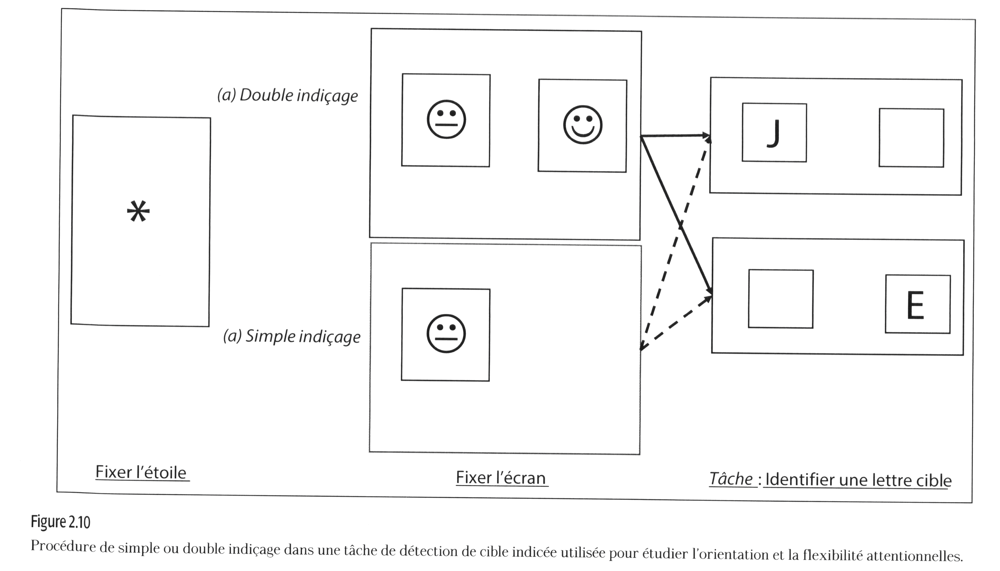

::: notes
Principe: 2 variantes (simple ou double)
Tâche à Indiçage unique: 1/vue d’un signal, 2/ puis très brièvement un indice, 3/ une lettre cible à identifier (ou sur laquelle formuler un jugement type consonne ou voyelle)
La lettre apparaît, soit du même côté que l’indice (indiçage spatial valide), soit de l’autre côté (indiçage spatial invalide). Le temps pris pour identifier (ou juger) la cible présentée du même côté que l’indice renseigne sur le temps d’engagement attentionnel. Si la cible apparaît de l’autre côté -> temps de désengagement attentionnel.
Pour le double indiçage, le participant voit deux indices et le chercheur détermine quel indice entraîne le plus court temps de jugement ou d’identification de la cible.
:::

## Fonctions de l'attention

- Attention partagée (ou divisée)

    - Diviser ses ressources attentionnelles entre plusieurs tâches, informations ou dimensions d’un stimulus
    - Commence à décliner vers 20 ans

- Attention préparatoire

    - Permettre la préparation du système cognitif à traiter un stimulus
    - Commence à décliner vers 50 ans
    
::: notes
Attention divisée testée par la tâche du running span par exemple. Le participant entend des séries de chiffres sans connaître leur longueur et doit rappeler les 6 derniers. 
Ex : 7 – 2 – 3- 8-1- 4 – 7-9-3-6 - 8
:::

## Émotions et attention en recherche

- Focus sur attention sélective, orientation de l’attention et attention divisée 

- Mais il existe des travaux pour d’autres fonctions attentionnelles

- Méthodologie 

    - Réaliser des tâches connues mobilisant l’attention (VD)
    - Dans des contextes émotionnels variables (VI)
    
::: notes
On fait varier soit la nature des stimuli (émotionnels ou neutres), avant ou pendant la tâche (incidentes vs intégrales), ou plus rarement on utilise l’état émotionnel du patient (plus en psychopathologie) EX: rôle de l’anxiété sur l’attention chez des patients présentant un trouble de l’anxiété généralisé.
:::

## Émotion et attention : objectifs

- Voir comment les contextes émotionnels facilitent ou perturbent la réalisation de la tâche
- Déterminer si le mécanisme connu est modifié 
- Comprendre comment les émotions impactent les mécanismes attentionnels

## 

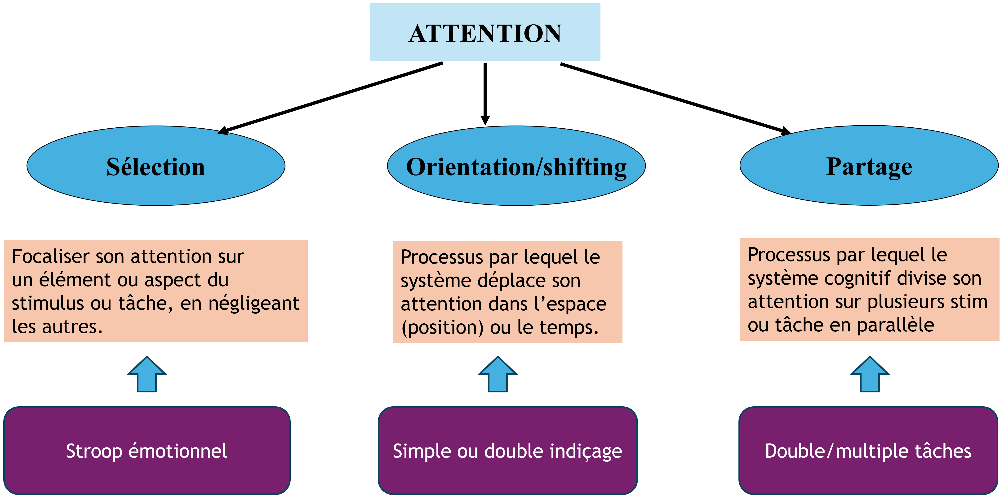

::: notes
Pour résumer, on va s’intéresser à ces trois fonctions de l’attention et à leur lien avec les émotions.
:::

## Questions de recherche

- Les émotions affectent-elles nos capacités attentionnelles?
- L’effet des émotions est-il le même pour toutes les fonctions de l’attention?
- L’effet des émotions sur l’attention évolue-t-il avec l’âge (mais aussi avec la pathologie et selon les caractéristiques individuelles)?
- Dans quelles conditions et par quels mécanismes les émotions affectent nos capacités attentionnelles?

# Émotion et attention sélective 

Les émotions ont-elles un effet sur nos capacités à sélectionner les éléments pertinents pour réaliser une tâche ?

## Stroop émotionnel

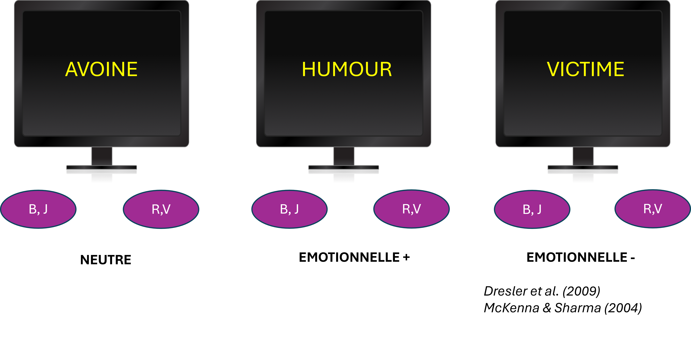

::: notes
Figure X. (données d’après McKenna & Sharna, 2004)

Mots neutres utilisés par McKenna & Sharma (2004): SAND, CLAY, CLOUD, SLOPE, FIELD, BANK, DITCH (fossé), PLAIN, FOREST, MARBLE, DIRT, STONE, GLASS, VALLEY, TUNNEL, HILL, TREE, OCEAN, FLOWER, LEAVES, ROAD, BUSH (buisson), FAULT, MEADOW (prairie), GRAVEL 

Mots émotionnels utilisés par McKenna & Sharma (2004): FAIL, FEAR, CRASH, GRIEF, DEATH, PAIN, ABUSE, ANGRY, MURDER, CANCER, HATE, SHOCK, ENEMY, AFRAID, MISERY, DOOM, KILL, GUILT, TRAGIC, THREAT, FIRE, RAGE, PANIC, SCREAM, SORROW 

Les participants voyaient des mots neutres (sable, nuage, champs) ou émotionnels (peur, panique, chagrin) présenté avec une encre de couleur bleue (B), jaune (J), rouge (R) ou verte (V). Ils devaient dire la couleur de l’encre sans prêter attention aux mots. La moitié des participants appuyaient sur une touche du clavier à droite pour dire si l’encre était de couleur rouge ou verte et à gauche si l’encre était bleue ou jaune (l’autre moitié faisait l’inverse). 
:::

## Résultats

*Dresler et al. (2009)*

Effets stroop émotionnels

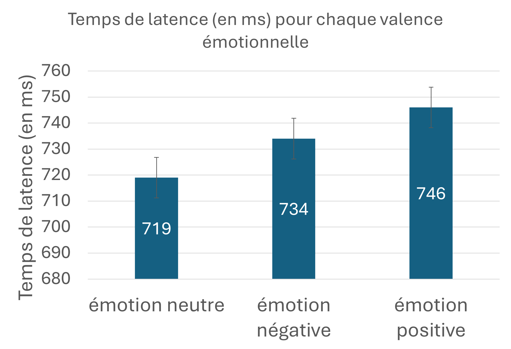

::: notes
Effets stroop émotionnels : il faut + de temps pour donner la couleur de l’encre d’un mot quand ce mot est émotionnel (+ ou -)
Cela peut s’interpréter comme le résultat d’une interférence créée par l’activité automatique de lecture de mots sur l’activité de dénomination de la couleur de l’encre. 
Les mots émotionnels
:::

## Résultats

- Effets stroop émotionnels plus forts en condition mixte (McKenna & Sharma, 2004)

    - Mots mélangés (neutre/émotion +/ émotion -)
    
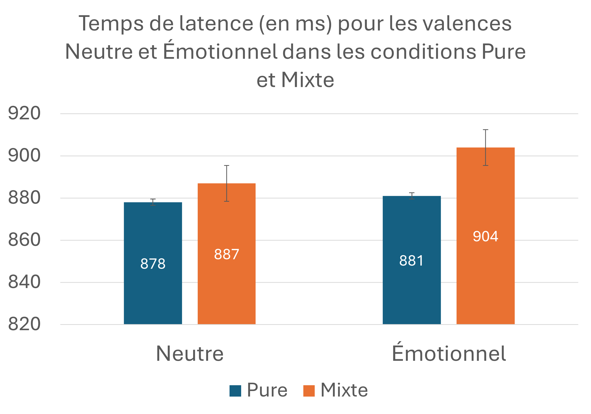
    
::: notes
L’effet stroop s’observe plus fort dans les conditions mixtes (voire uniquement dans les conditions mixtes, cf McKenna & Sharma). 
Fin S3
:::

## Émotion et attention sélective : conclusion {.scrollable}

- Beaucoup d’autres études, des réplications
- Les émotions perturbent les mécanismes de l’attention sélective

    - Mécanismes permettant d’inhiber les informations non pertinentes (e.g., étude stroop émotionnel)

- L’activation des émotions et leur traitement occupent de la ressource attentionnelle
- La tâche d’attention sélective est ralentie

::: notes
On vient de voir que l’on met plus de temps à réaliser la tâche de stroop quand on introduit des émotions dans les stimuli. Beaucoup d’autres études …
Ce que l’on peut conclure des études sur émotion et attention sélective, c’est …
Mécanismes permettant d’inhiber les informations non pertinentes : ce que l’on a vu dans la tâche de stroop. Mais cela est aussi valable pour les mécanismes qui permettent d’interrompre une réponse déjà déclenchée.
:::

# Émotion et orientation de l’attention/shifting

Les émotions ont-elles un effet sur nos capacités à diriger notre attention sur une information cible dans notre environnement ou sur une dimension importante d’un stimulus à traiter ?

::: notes
Rappel : on avait parlé de l’étude de Fox et al., 2007 de recherche visuelle d’intrus. Ce type d’études permettait de répondre à la première question. Oui, on dirige notre attention plus rapidement vers un stimulus quand il a une dimension émotionnelle (c’était le cas pour le serpent et le pistolet, c’est aussi le cas pour les visages menaçants parmi les visages neutres), et encore plus quand la valence des informations émotionnelles est négative.
je vais vous présenter une autre expérience avec des visages cette fois.
:::

## Variante avec des visages (Fox et al. (2007) 

::: {layout-ncol=2}

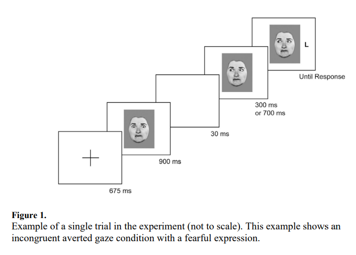
:::

::: notes
Photographies de 4 hommes et 4 femmes (Ekman & Firesen, 1976)
Uniquement la partie centrale du visage visible (cheveux et arrière-plan effacés)
Expression neutre/apeurée/en colère/heureuse
Regard central/vers la gauche/vers la droite
Les participants doivent appuyer sur le bouton correspondant à la lettre, T ou L (boutons placés verticalement pour minimiser l’interférence due à la position des cibles (droite ou gauche)).
On fait passer le test à des participants anxieux et non anxieux.
:::

## Résultats : temps de latence regards dirigés vers le centre

- Pour les regards vers le **centre** (pas d'indice regard)
- Interaction Groupe x Expression émotionnelle  : *F*(3, 114)= 24.2, *p* <.001

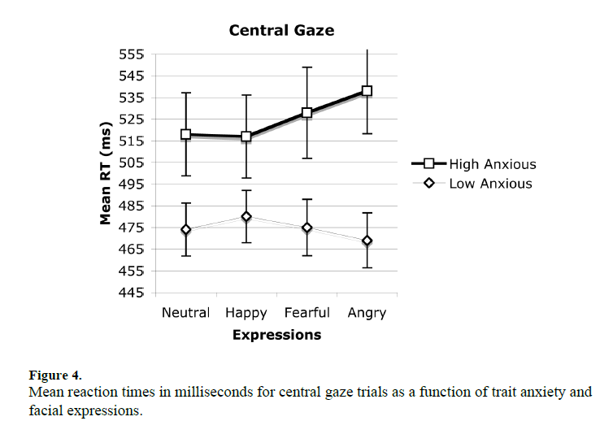

::: notes
Temps de latence des réponses (SOA : Stimulus onset asynchrony = temps entre l’apparition du stim et celle du suivant, SOA réglé sur deux valeurs, effet du SOA mais pas d’interaction). Plus le participant répond vite, plus le temps de latence est bas. Les meilleurs scores sont donc les scores les plus faibles, les plus bas sur la courbe.
Pour une interaction :
df=(a−1)(b−1)
où :
a = nombre de niveaux du facteur 1
b = nombre de niveaux du facteur 2

Donc : (2−1)×(4−1)=1×3=3
Pour un facteur intra-sujet avec k niveaux :
df effet = k − 1
df erreur = (n − groupes) × (k − 1)
Les participants non anxieux répondent + vite (hyp: se désengagent plus rapidement de l'image pour appuyer sur le bouton) que les participants anxieux. L'émotion impacte différemment les participants selon leurs caractéristiques individuelles.
:::

## Résultats : temps de latence regards dirigés vers la gauche/droite {.scrollable}

Pour les regards dirigés à droite ou à gauche : 

- Effet principal du SOA (temps d'exposition), *F*(1, 38)= 214.8, *p* <.001

    - réponses plus rapides quand SOA long
    
- Effet de la congruence mais interaction, alors on n'analyse pas l'effet principal mais les effets simples    
- Interaction Groupe x Expression émotionnelle x Congruence : *F*(3, 114)= 12.2, *p* <.001

::: {layout-ncol=2}

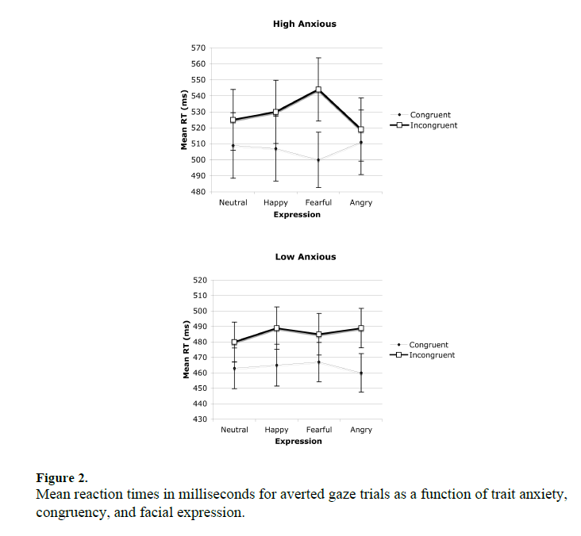

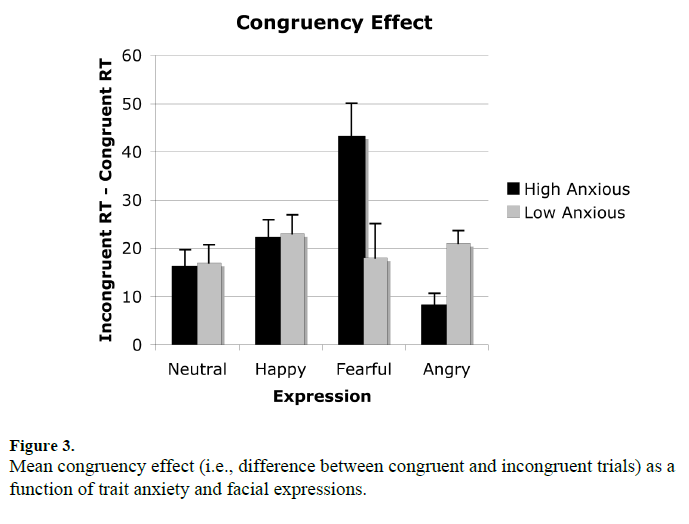

:::

::: notes
Regard incongruent : le regard va vers la gauche et la cible est à droite, ou l’inverse. Congruent : cible et regard dans la même direction.
Effet principal de la congruence : tous les participants sont plus rapides quand c’est congruent. Quand la cible apparaît dans la direction du regard de la photo, le participant la repère plus vite. Mais analyse des effets simples car interaction. Effet simple : effet de la congruence dans chaque condition (!= effet principal, effet en moyennant les autres facteurs du modèle)
On voit qu’il y a une interaction. Les participants anxieux n’ont pas les mêmes résultats que les participants non anxieux.
:::

## Discussion {.scrollable}

- Regard central (vers le participant) : Les visages en colère ralentissent les réponses des participants anxieux -> retiennent davantage l'attention

- Effet de la congruence => la direction du regard d’une autre personne a un effet sur l’attention de l’observateur

    - Suit la même direction
    - Facilite la détection de la cible
    
- Interaction Congruence x Expression émotionnelle x Groupe

    - Hypothèse : regard apeuré -> danger dans l'environnement
    - Pas d’effet spécifique chez les sujets non anxieux
    - Mais augmentation significative de l'effet de congruence chez les sujets anxieux
    

- => Variabilité interindividuelle dans l’orientation de l’attention 
- Si l'attention visuelle est automatique, elle est modulée par le caractère émotionnel des stimuli et des participants

::: notes
Un regard apeuré signalant un danger, la condition peur +congruence devrait être associée à la détection la plus rapide de la cible, surtout chez les anxieux : Oui.
Si on reprend l’hypothèse d’un fonctionnement automatisé de l’attention visuelle, cette étude suggère qu'il est modulé par le caractère émotionnel des stimuli et celui des participants.
:::

## Émotion et orientation de l’attention : conclusion

- Nos émotions influencent l’orientation de l’attention
- Recherche visuelle : orientation de l’attention plus rapide vers les stimuli à valence émotionnelle /neutres
- Stimuli à valence émotionnelle – semblent être traités plus rapidement que +
- Les informations à valence émotionnelle – sont d’autant plus vite traitées que les participants ont des traits émotionnels –  

::: notes

:::

# Émotion et attention partagée

Les émotions ont-elles un effet sur nos capacités à partager nos ressources attentionnelles ?

::: notes
Nous sommes très souvent amenés à faire plusieurs actions en même temps (ex : conduire en écoutant de la musique), à considérer plusieurs dimensions d’un stimulus simultanément (ex: quand on est en examen, on considère la longueur du sujet et sa complexité en même temps), à maintenir plusieurs informations en mémoire de travail (ex du calcul mental), ou encore à traiter en parallèle plusieurs sources d’information (ex d’une conversation de groupe).
:::

## Émotion positive et partage de l’attention

- Martin & Kerns (2011)
- 2 conditions : émotion neutre/positive

    - Vidéos de pose de parquet / série Seinfeld

- Tâche de running span : séries de 12 à 20 chiffres entendues, rappeler les 6 derniers

::: notes
Les vidéos font le même temps.
Les participants sont assignés à un groupe au hasard au départ.
Vérification de l’état émotionnel après visionnage avec un questionnaire : Comment vous sentez-vous maintenant ? 16 mots (valence +/-, intensité forte/faible, exemple : serein, ravi, inquiet, en colère) et les participants répondent sur une échelle en 5 points de pas du tout à très fortement
:::

## Martin & Kerns (2011)

:::: {layout-ncol=2}

::: {#first-column}

- Expérience 1 : en inter (*between-subject*)

- Participants assignés à un groupe au hasard
- Induction vidéo : 10 minutes (induction), puis 5 minutes (booster)
:::

::: {#second-column}
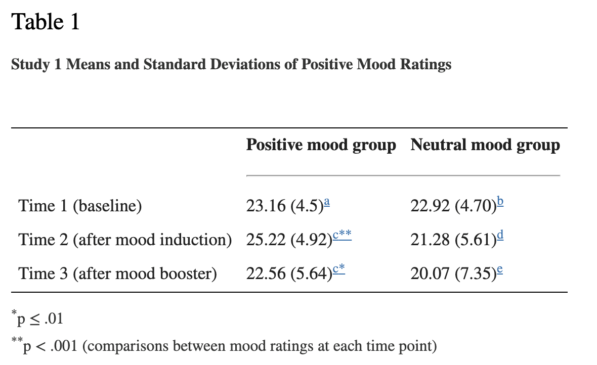
:::

::::

## Martin & Kerns (2011)

:::: {layout-ncol=2}

::: {#first-column}

- Expérience 1 : en inter (*between-subject*)

- Le groupe + réussit moins bien la tâche de RMS
- *t*(178) = 2.14, *p* < .05, *d* = .32
:::

::: {#second-column}
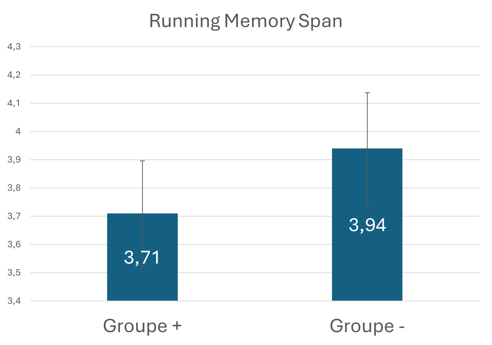

:::
::::

::: notes
Que veut dire inter ? Chaque groupe ne sera confronté qu’à une seule modalité
d=.32, d de Cohen, qui montre un effet entre faible et moyen
d=.2 : effet faible, d=.5, effet moyen, d=.8, effet fort

Quelles sont les limites de l'étude ? Est-ce qu'on peut conclure sur le fait que l'émotion positive affecte l'attention partagée ? En est-on sûr et si non, comment apporter davantage de preuve ? 

Pour répliquer et vérifier qu’il n’y avait pas de déséquilibre dans les groupes faits au hasard sur les capacités attentionnelles, réplication, mais cette fois, … en intra
:::

## Martin & Kerns (2011)

:::: {layout-ncol=2}

::: {#first-column}

- Expérience 2 : en intra (*within-subject*)

- Le groupe + réussit moins bien la tâche de RMS
- *t*(89) = 2.58, *p* < .011, *d* = .27
:::

::: {#second-column}
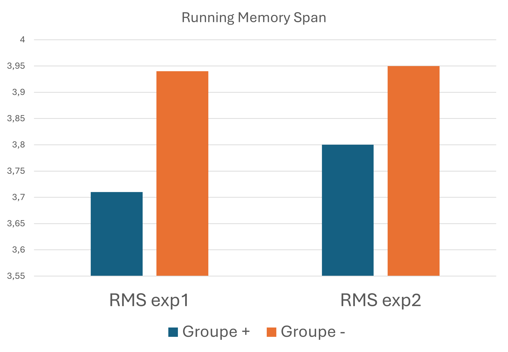

:::
::::

::: notes
pourquoi refaire l'expérimentation en intra ?
:::

## Émotion négative et partage de l'attention {.scrollable}

:::: {layout-col=2}

::: {#first-column}
 
- Shackman et al. (2006)
- Tâche de N-back

    - Verbale (-) /spatiale (--)

- Induction émotionnelle

    - Menace d’un choc électrique
    - Pas de menace de choc 

- Menace de choc

    - Information : entre 1 et 7, d’intensité croissante
    - Réalité : 1 choc

- Tâche et induction en intra, contrebalancées 

:::

::: {#second-column}
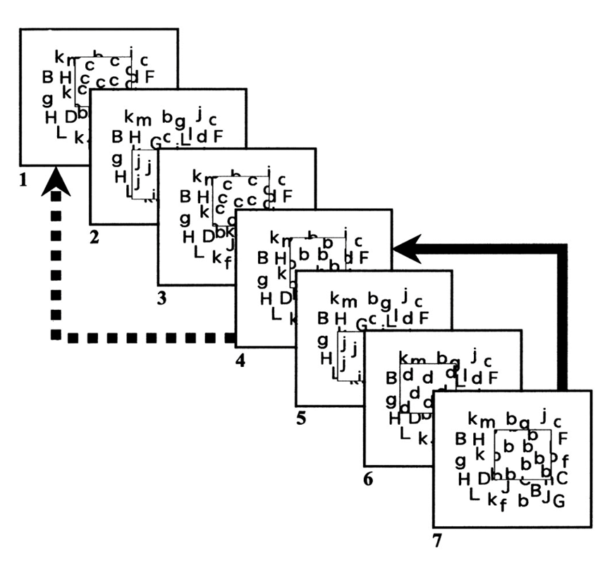
:::
::::

::: notes
Le principe de la tâche de N-back : tâche de jugement, le participant doit indiquer si ce qu’il voit est identique à l’item présenté N items avant, ou pas. 
Ici c’est une tâche verbale et spatiale. Voici les stimuli présentés. Le participant doit dire si l’item présenté 3 items avant est le même ou pas. Pour la tâche verbale, le participant devait dire s’il avait vu les mêmes lettres dans le carré. Pour la tâche spatiale, il devait dire si le carré était au même endroit.
Les participants font les deux tâches et elles sont contrebalancées.
L’émotion négative est induite par la menace d’un choc électrique et pour l’état neutre, pas de menace de choc électrique.
Arguments de choix du choc électrique : pas de familiarité (contrairement aux films), pas de contenu qui fait une charge cognitive supplémentaire
Les électrodes sont débranchées dans la condition pas de menace de choc
:::

## Émotion négative et partage de l'attention

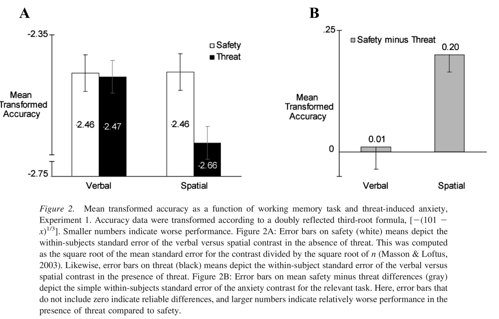

::: notes
On voit que le résultat est comparable dans les deux conditions pour la tâche verbale, mais est très différent pour la tâche spatiale. 
L’émotion négative a un effet négatif sur l’attention partagée dans sa dimension spatiale
:::

## Émotion négative et partage de l'attention {.scrollable}

- Menacés de choc électrique, les participants peuvent partager leurs ressources attentionnelles verbales aussi bien que sans menace

- Mais leurs ressources attentionnelles spatiales sont négativement impactées 

- Hyp : gérer l’anxiété et ressources attentionnelles spatiales pourraient partager les mêmes réseaux cérébraux

- Intérêt de la méthodologie de l’étude : différenciation des phénomènes observés

::: notes
Intérêt de la méthodo de l’étude, elle permet une différenciation des phénomènes observés et de montrer que certains mécanismes sont préservés alors que d’autres sont impactés au sein d’une même fonction.
:::

# Émotion et attention - Conclusions

Attention sélective, orientation de l’attention, attention partagée, quels effets de l’émotion ? 

## Conclusions {.scrollable}

- Influence importante (+/-) des émotions sur l’attention

    - Positive quand elles dirigent vers des aspects pertinents des stimuli
    - Négative quand elles dirigent vers un aspect non pertinent

- Nos émotions changent :

    - Ce à quoi nous prêtons attention / nous ne prêtons pas attention
    - Comment nous le faisons
    - Les ressources attentionnelles allouées à la tâche

- Mais on ne sait pas encore si c’est toujours le cas, et pour tout le monde 

::: notes
Ex positive : regards apeurés vers la cible
Ex négative : stroop émotionnel
Nos émotions changent ce à quoi nous faisons attention, comment nous prêtons attention aux informations, et donc, à quoi nous ne prêtons pas attention à cause d ’une trop grande mobilisation attentionnelle sur les informations émotionnelles non pertinentes pour la tâche à réaliser. 

Il faut encore faire beaucoup d’études pour comprendre plus finement comment l’émotion affecte l’attention. Dans l’étude de Schackman et al., on a vu par exemple que l’émotion négative n’impactait qu’une partie de l’attention partagée
:::

## Conclusions

- Fonctions du système attentionnel : s’orienter vers et sélectionner les informations pertinentes pour réaliser une tâche cognitive
- Les émotions ont une influence parfois négative … au labo
- Est-ce qu’efficacité attentionnelle au labo et hors labo sont les mêmes ?

    - Face à un prédateur
    - Pour détecter et analyser un danger potentiel

- L’optimisation des mécanismes attentionnels via les émotions n’est pas la même 

::: notes
Ex de la voiture et du piéton : si on conduit et que notre attention spatiale est diminuée face à une émotion négative au téléphone par exemple, on risque de ne pas bien analyser l'environnement. influence négative de l'émotion au labo ET hors labo.
Par contre, le fait de prioriser le danger sur les autres activités est souvent bénéfique. Ex : focaliser son attention sur la signalisation plutôt que sur la tâche en cours (consultation GPS)
Ex impact – de l’émotion sur la tâche de stroop émotionnel, mais dans la vraie vie c’est plutôt bien que l’on sélectionne le danger par exemple.
:::

# Partie 3 - Émotion et mémoire

## Émotion et mémoire {.scrollable}

- Notre mémoire fonctionne-t-elle mieux lorsque nous sommes heureux que lorsque nous sommes tristes ? 
- Retenons-nous plus facilement et pour plus longtemps une bonne nouvelle qu’une mauvaise nouvelle ?
- Rappelons-nous plus d’informations relatives à des événements tristes que relatives à des événements joyeux ou neutres quand nous sommes tristes, et plus d’informations relatives à des événements joyeux quand nous sommes joyeux ? 
- Le type, la nature et le nombre d’informations émotionnelles et neutres récupérées n’ont-ils rien à voir avec notre état émotionnel au moment du rappel ? 
- Pour retrouver un souvenir lointain d’un événement vécu dans un certain contexte émotionnel et enfoui très profondément dans notre mémoire, est-il important de se remettre dans ce contexte émotionnel et de ré-éprouver ou revivre d’une manière ou d’une autre la même émotion que celle ressentie au moment où l’événement est arrivé ? 
- Ou, au contraire, est-il tout à fait possible de retrouver un souvenir sans avoir à réactiver un contexte émotionnel initial au moment de la recherche d’un souvenir ? 
- Se replonger dans les émotions ressenties au moment où est survenu un événement de notre vie aide-t-il à retrouver plus d’informations sur cet événement ? 
- Si oui, quel type d’informations (informations plus détaillées, plus précises et exactes vs. informations plus générales et moins précises, moins exactes ? 
- Sinon, l’émotion réactivée en nous bloque-t-elle complètement la récupération d’informations pourtant stockées au moment de l’encodage et conservées dans notre mémoire ?

## Plan de la partie 3 - Émotion et mémoire

1. Les émotions améliorent la mémoire

2. Les émotions dégradent la mémoire

3. Effets de congruence affective, de dépendance au contexte émotionnel et de trade-off

::: notes
Plan de ce que l’on va voir sur émotion et mémoire. On va s’intéresser aux effets positifs des émotions sur la mémoire …
Trade-off : compromis/troc
:::

# Effets positifs des émotions sur la mémoire

Effets d’amplification mnésique – quand les émotions améliorent la mémoire

::: notes
Cet effet a été étudié dans de nombreuses études. Qu’observe-t-on ?
:::

## Effet d’amplification sur des mots isolés {.scrollable}

Davidson et al. (2006)

- Stimuli : mots neutres (e.g., foot, dustpan) / mots émotionnels (e.g., cash, rollercoaster)
- Procédures : 

    - Écoute des mots lus pour moitié par un homme/femme et jugement neutre/émotionnel (appui sur un bouton)
    - Lecture des mots écrits en violet ou orange

- Puis, surprise :

- Rappel d’items 
- Rappel de la source : male/female ; violet/orange

::: notes
Les participants ont d’abord jugé une liste de mots selon l’intensité et la valence émotionnelle et les listes de mots utilisées ensuite ont été construites à partir de ces jugements (-> mots neutres/émotionnels).

Plusieurs expériences.
Les participants ne savent pas qu’ils vont devoir rappeler 
:::

## Effet d’amplification sur des mots isolés {.scrollable}

:::: {layout-col=2}

::: {#first-column}

Davidson et al. (2006)

- Plus (+) de rappel des mots émotionnels
- Pas de différence de rappel de la source

    - en visuel comme en auditif
    
:::

::: {#second-column}
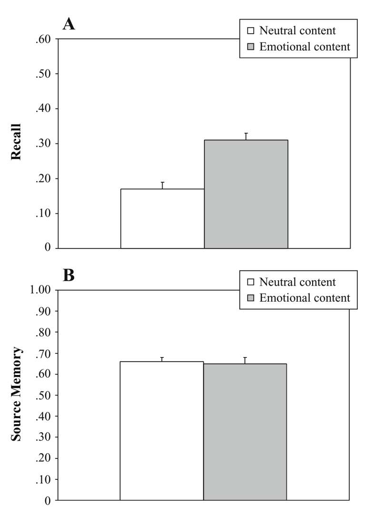

:::

::::

::: notes
Il y a plusieurs résultats (car plusieurs procédures) mais les résultats sont consistants/cohérents (cf graphique). 
:::

## Effet d’amplification sur des textes/scènes

Cahill & McGaugh (1995)

- Encodage : présentation de 12 diapos, un récit par diapo
- 2 conditions : diapo et récit neutres/ diapo et récit émotionnels
- Regarder les diapos et écouter les récits : 
  
    - évaluation de la valence émotionnelle (0: pas du tout émotionnel à 10: extrêmement émotionnel)

::: notes
Inter sujet
On ne dit pas aux participants qu’ils vont devoir rappeler des éléments. Fin S5
:::

## 

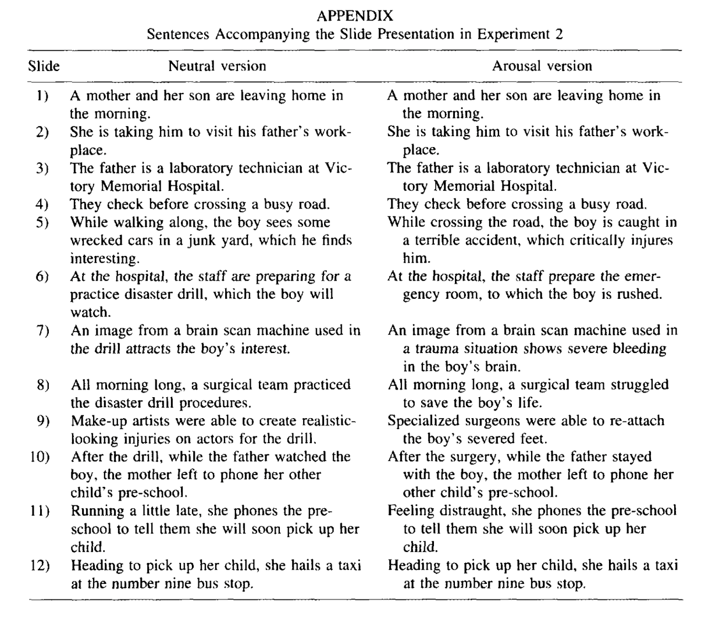

::: notes
drill: simulation 
distraught : désemparée
:::

## 
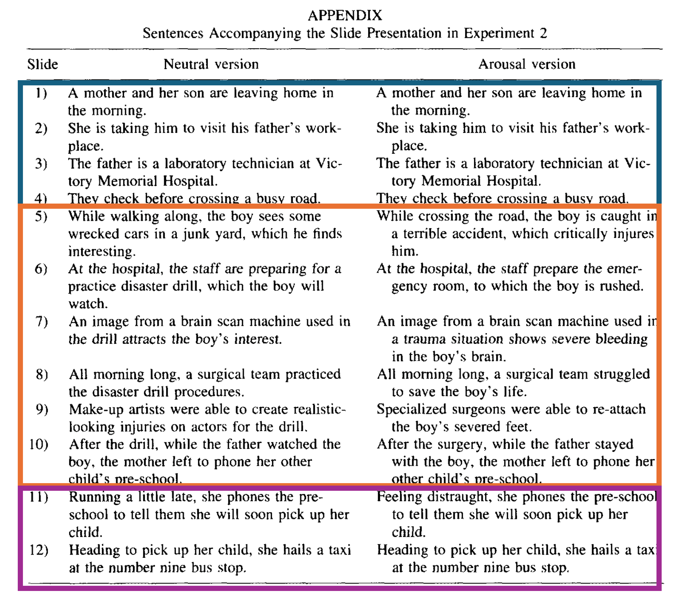

::: notes
Phase 1/Phase 2/Phase 3 : phases 1 identiques et phases 3 proches dans les deux conditions 
:::

## Effet d’amplification sur des textes/scènes

Cahill & McGaugh (1995)

- 2 semaines plus tard, surprise

    - Tâche de rappel libre 
    - Tâche de reconnaissance 
        
      - 5 à 8 questions par slide, 1 réponse correcte et 3 réponses plausibles par question 

::: notes
Tâche de rappel libre, le participant rappelle tous les éléments dont il se souvient.
Tâche de reconnaissance : 80 questions (5 à 8 par slide). Pour chaque question, 1 réponse correcte et 3 réponses plausibles sont proposées.
:::

## Effet d’amplification sur des textes/scènes {.scrollable}

Meilleure mémorisation des éléments émotionnels

::: {layout-col=2}

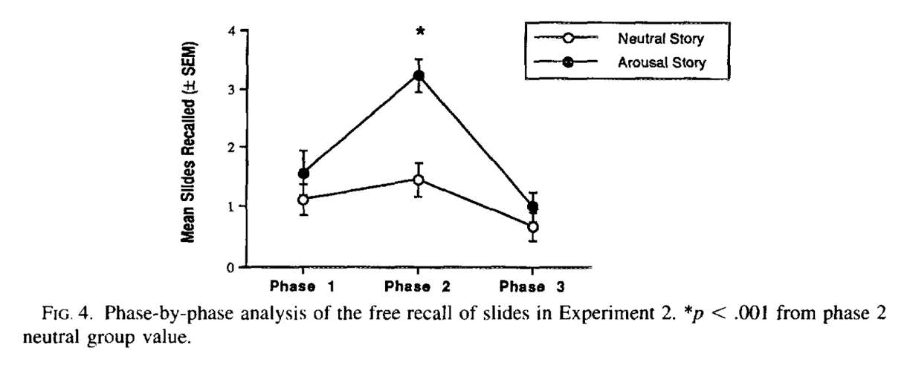

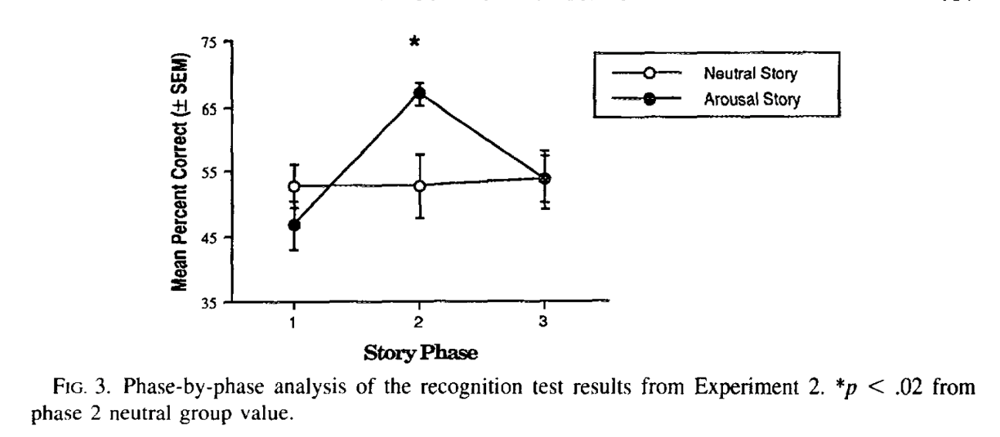

:::

::: notes
C'est bien que l'on ne voie pas d'écart entre les groupes sur les phases 1 et 3 => la différence dans la phase 2 ne vient pas de la capacité de mémorisation
:::

## Effet d’amplification sur des textes/scènes

Si on regarde le détail des slides 

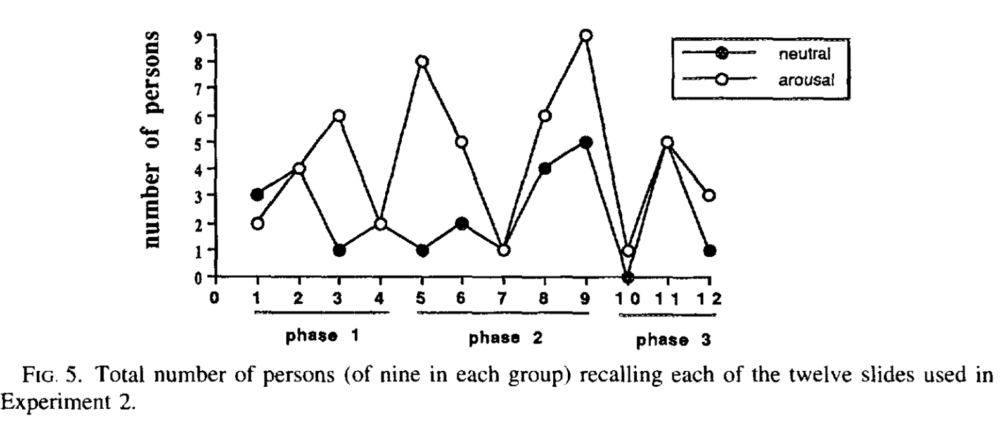

::: notes
RMQ : 7 Une image de cerveau attire le regard de l’enfant/ Une image de cerveau montre un saignement de l’enfant. Fin S6
:::

## Effet d’amplification de la mémorisation : dû à l'émotion ou au fait de parler de ce que l'on a vu ? {.scrollable}

Guy & Cahill (1999)

- Stimuli : 6 vidéos (2-3 minutes) émotionnelles et 6 vidéos neutres (intra)
- 2 conditions : ne pas en parler/ en parler à au moins 3 personnes (inter)

- Tâches : 

  1/ Visionnage des vidéos et jugement émotionnel (0 à 10)
  2/ Une semaine après, rappel surprise (rappeler le max de choses dont ils se souvenaient des 12 films) 

::: notes
On peut se demander si communiquer autour des vidéos aide à mieux se souvenir, au-delà de l’émotion
Vidéos émotionnelles : mutilation d’animaux, crimes violents
Vidéos neutres : procès au tribunal, cascadeur
Plan mixte : tous les participants voient toutes les vidéos mais ils sont assignés à une seule condition de communication.
Demander de dessiner les résultats auxquels on pourrait s’attendre. Que mettrait-on en ordonnée (=VD : nb d’éléments rappelés) ? Que mettrait-on en abscisse (=VI : 1/ vidéos neutres/émotionnelles et 2/ Groupe parler/ne pas parler) ?
:::

## Résultats

Guy & Cahill (1999)

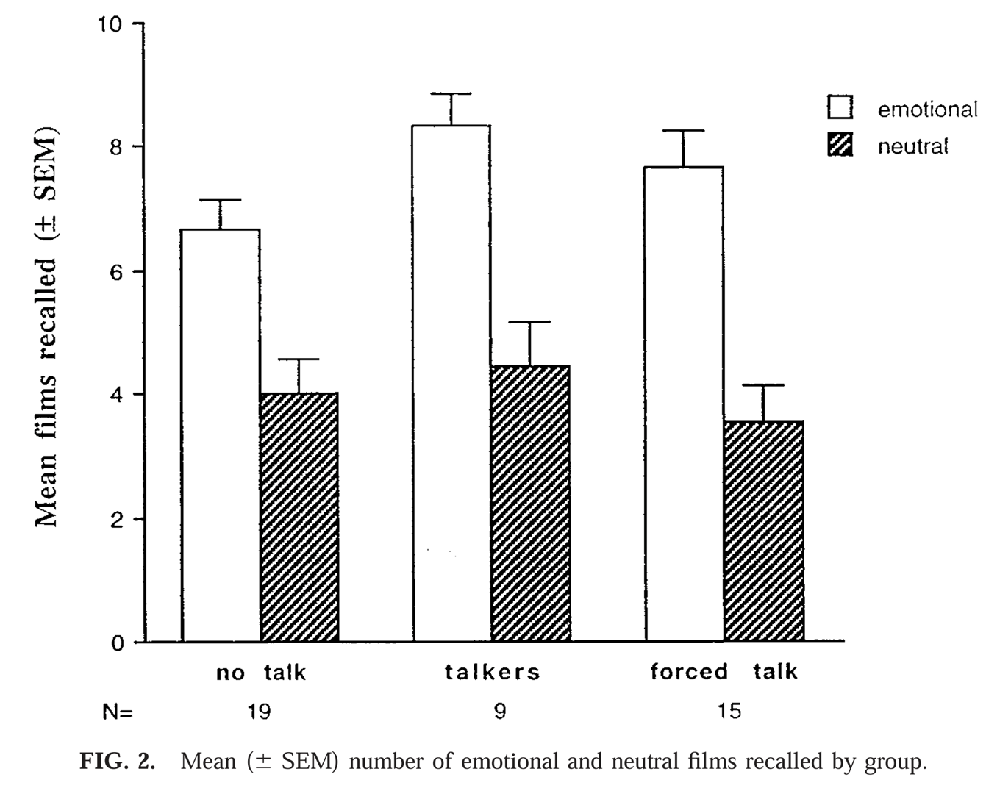

::: notes
Talkers : les participants qui avaient pour instruction de ne pas parler mais qui ont parlé quand même 
Les films émotionnels sont mieux rappelés que les films neutres. 
Pas de différence entre ceux qui ont parlé et ceux qui n’ont pas parlé. 
La répétition post-encodage n’est donc pas nécessaire pour un meilleur rappel des informations émotionnelles.
:::

## Effet d’amplification sur le contexte ? {.scrollable}

- Situation émotionnelle : est-ce que le contexte des informations cibles est également mieux mémorisé ?
- Parfois oui (Doerksen & Shimamura, 2001)
- Parfois non (Davidson et al., 2006)
- Comment expliquer ces différences ?

- => Bénéfice de l’émotion de l’information cible uniquement quand on demande au participant de se focaliser sur le contexte

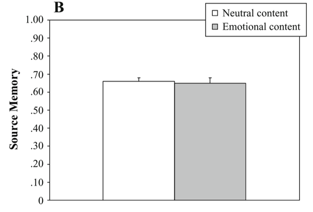

::: notes
Est-ce qu’au-delà des stimuli, le contexte dans lesquels ils sont encodés est également mieux rappelé dans une situation émotionnelle ?
(Doerksen & Shimamura, 2001) : mots à rappeler, couleur d’encre et de cadre (bleu ou jaune) = contexte. Tâche de rappel de mots puis de rappel de la couleur (mots présentés en noir). Contexte mieux rappelé quand mots émotionnels
(Davidson et al., 2006) : on en a parlé avant, mots de couleurs (violet/orange) et voix d’homme/femme
Laisser chercher l’explication des différences : bénéfice de l’émotion de l’information cible uniquement quand le participant est explicitement amené à traiter l’information contextuelle (si pas de demande de focalisation sur le contexte, pas de bénéfice de la cible émotionnelle sur le contexte)
:::

# Effets négatifs des émotions sur la mémoire

Effets de dégradation mnésique - quand les émotions dégradent la mémoire

## Émotions négatives dues au stress

Kuhlmann et al. (2005)

- Encodage liste de 30 mots : 10 neutres, 10 positifs, 10 négatifs
- Rappel immédiat – deux groupes équivalents
- 2 conditions 

  - contrôle – raconter un film 
  - stress – discours devant évaluateurs (Trier Social Stress Test)

- Tâche de rappel (différé)

::: notes
Les participants sont venus deux jours au laboratoire. Le premier jour, l’expérimentateur leur a présenté une liste de 30 mots (10 neutres, 10 positifs, 10 négatifs) sur une feuille. Les participants avaient deux minutes pour en apprendre le plus possible. Ensuite, ils devaient rappeler le plus de mots possible. Cette procédure a été renouvelée une deuxième fois pour augmenter l’apprentissage. Le lendemain, les participants sont revenus au laboratoire et ont été testés, pour le rappel, soit dans une condition avec stress, soit dans une condition sans stress. Dans la condition avec stress, les participants devaient d’abord préparer, pendant 2 minutes, un discours sur un entretien d’embauche au cours duquel il fallait mettre en avant ses qualités personnelles. Ensuite, les participants donnaient ce discours pendant 5 minutes devant deux évaluateurs (embaucheurs potentiels) vêtus d’une blouse blanche, discours filmé. Enfin, pendant 5  minutes, ils devaient compter à rebours par pas de 17 à partir de 2043. Cette condition est connue pour produire du stress (augmentation de cortisol). Dans la condition contrôle, le discours consistait à raconter un film; il n’était pas donné devant deux évaluateurs en blouse blanche; et il n’était pas filmé. Après le discours, les participants devaient rappeler les mots appris la veille et dont ils se souvenaient. 
:::

## Résultats {.scrollable}

:::: {layout-col=2}

::: {#first-column}

- Moins de mots négatifs et positifs en condition stress qu’en condition contrôle
- Mais autant de mots neutres
    
:::

::: {#second-column}

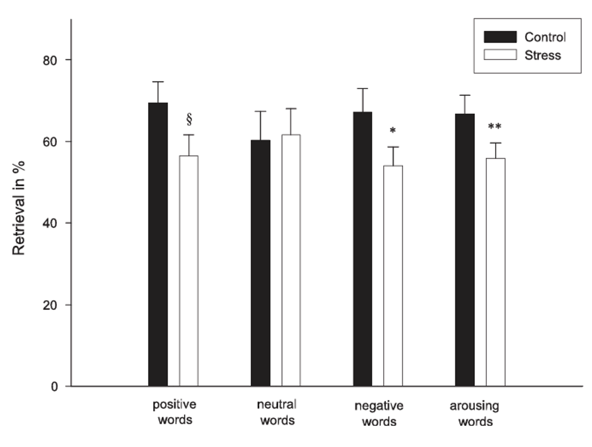

:::

::::

::: notes
Effects of the stress versus the control condition on delayed memory retrieval of words learned 24 h earlier. Results are expressed as percentages of the second (and last) learning trial of the previous day. Each word list contained 10 positive, 10 neutral, and 10 negative words. The category “arousing words” is a post hoc created category containing the positive and the negative words. §p  0.1, *p  0.05, and **p  0.01, differences in paired t tests. For additional statistical analysis using ANOVAs, see Results. Error bars represent SE§ p<.1; * p<.05, **p<.01
Arousing words : mots émotionnels
:::

## Effet des émotions liées au stress sur la mémoire {.scrollable}

- Effets délétères du stress sur les performances mnésiques robustes

  - Dans et hors laboratoire
  - Montrés sur l’encodage, le maintien, la récupération

- MAIS des études montrent que le stress n’a pas d’effet délétère sur la mémorisation d’informations émotionnelles (e.g., Payne et al., 2006)

  - Diapos et récits du garçon à l’hôpital/ TSST
  - Effet – du stress sur l’encodage des informations neutres
  - Mais pas d’effet sur l’encodage des informations négatives 
  - Saillance des informations émotionnelles -> attention -> encodage + profond

::: notes
Ces effets ont été montrés dans différents contextes expérimentaux et sur l’ensemble des mécanismes mnésiques.
Mais certaines études montrent également qu’il n’y a pas d’effet du stress sur la mémorisation des informations émotionnelles. C’est l’étude dont on a parlé avec les diapos sur le petit garçon qui va visiter l’hôpital/qui a un grave accident et est emmené à l’hôpital (Cahill & McGaugh (1995). L’expé a été faite en condition contrôle et condition TSST (Trier Social Stress Test) avant le visionnage des diapos
:::

## Qu'en conclure ? 

- Les émotions améliorent les performances mnésiques/ les dégradent à d’autres moments
- Méthodologie

  - Manipulation de la valence émotionnelle des informations à mémoriser => Montrent une amélioration
  - Manipulation de l’état émotionnel du participant => dégradation
  
::: notes
Si on regarde la méthodologie des études, on voit que si on manipule la valence ... 
Une fois que l'on a ces conclusions sous les yeux, quelle est la prochaine étape ? = > aller expériementer la conjonction de la manipulation du matériel et de l'état émotionnel
:::

## Qu'en conclure ?

- Que se passe-t-il pour les performances mnésiques quand l’état émotionnel du participant et la valence émotionnelle du matériel sont étudiés conjointement ?

  - Congruence : e.g., informations tristes et participant triste
  - Incongruence : e.g., informations tristes et participant joyeux

# Effets de congruence affective, de dépendance aux contextes et de tunnel

Valence émotionnelle des stimuli et état émotionnel des participants congruents 

::: notes
expliquer congruent : dans le même sens
:::

## Congruence affective et mémoire

- Est-ce qu’on rappelle plus d’informations tristes quand on est triste ?
- Rappel de plus d’informations joyeuses quand on est joyeux\ ?
- Est-ce que la congruence affective a un effet sur la mémoire\ ?
  
  - Sur l’encodage ?
  - Sur le maintien ?
  - Sur le rappel des informations ?

::: notes
On va voir pour exemple des études parmi les premières qui se sont focalisées sur ces questions
:::

## Effet de congruence affective sur la récupération d’informations

Bower et al. (1978, 1981)

- 2 conditions : état émotionnel joyeux/ triste (hypnose)
- 2 tâches

  - Rappel de souvenirs autobiographiques (journal/diary)
  - Rappel de souvenirs épisodiques (textes lus)

- Informations rappelées positives et négatives

::: notes
Bower et al. (1978) ont demandé aux participants de tenir un journal quotidien dans lequel ils devaient noter tous les événements émotionnels et évaluer sur une échelle d’intensité de 1 (peu intense) à 10 (très intense) chacun de ces événements. Une semaine plus tard, les participants sont revenus au laboratoire et, par hypnose, étaient mis dans un état émotionnel positif ou négatif. Ils devaient alors essayer de rappeler le plus d’événements consignés dans leur journal quotidien. Bower et ses collaborateurs ont fait une autre expérience où ils ont demandé à leurs participants de rapporter des souvenirs anciens (correspondant à des événement survenus avant leur 15 ans) dans un état émotionnel soit joyeux soit triste (aussi induit par hypnose). Les données ont également révélé un effet de congruence affective : les participants rappelaient davantage de souvenirs anciens agréables dans un état émotionnel positif et de souvenirs anciens désagréables dans un état émotionnel négatif. Dans une autre série d’études, Bower et al. (1981) ont mis, par hypnose, leurs participants dans un état joyeux ou triste avant de leur faire lire un texte présentant deux personnes qui se retrouvent pour jouer au tennis. L’un des deux était décrit comme quelqu’un de triste ou l’autre comme quelqu’un de joyeux. Le jour suivant cette phase d’encodage, ils ont demandé à leurs participants de rappeler le plus d’informations possible dont ils se souvenaient concernant les textes lus la veille. 
:::

## Bower et al. (1978, 1981)

:::: {layout-col=2}

::: {#first-column}

- Les participants rappellent plus d’informations positives dans un état émotionnel positif
- Plus (+) d’informations négatives dans un état émotionnel négatif
- Pour les souvenirs autobiographiques ET épisodiques
- => Effet de congruence affective
:::

::: {#second-column}

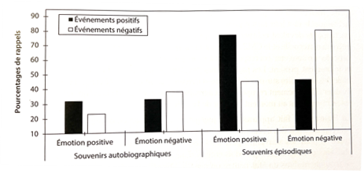
:::

::::

::: notes 

Souvenirs épisodiques : dans beaucoup d’études expérimentales on distingue :
autobiographique → souvenirs réels de vie
épisodique expérimental → matériel appris en labo
:::

## Effets de congruence affective

- Notre mémoire dépend de notre état émotionnel

  - Rappel, encodage et maintien : effet de congruence (Bower et al., 1978; 1981)

- Notre mémoire dépend aussi de la valence émotionnelle du matériel

- Influence séparée de notre état émotionnel et de la valence émotionnelle du matériel

- MAIS aussi effet de la congruence affective

::: notes
la congruence affective a un impact sur la mémorisation. A-t-elle également un impact sur le jugement que l'on porte à nos souvenirs ? 
:::

## Effets de congruence affective sur le jugement de souvenirs récupérés {.scrollable}

Miranda & Kihlstrom (2005)

- 3 conditions : état émotionnel joyeux/ neutre/ triste (induction musicale)
- 2 tâches 

  - Rappel de souvenirs autobiographiques anciens/récents
  - Jugement de valence émotionnelle des souvenirs récupérés de -4 (très désagréables) à +4 (très agréables)
    
    - à l'époque
    - maintenant 

- 3 types d’événements rappelés : positifs, neutres, négatifs 

::: notes
1/ les participants écoutent une des musiques
2/ les participants voient défiler 30 mots inducteurs (10 + (ex: cadeau), 10 neutres (ex: table) et 10 – (ex: araignée))
3/ pour chaque mot, les participants doivent dire le premier souvenir auquel cela leur fait penser
RMQ: si mot précédé de  »ancien », donner un souvenir entre la maternelle et le CM2, si mot précédé de « récent », événement situé entre le collège et le présent.
4/ évaluer la valence émotionnelle de chaque souvenir sur l’échelle. Evaluer d’abord quand l’événement est survenu et au moment présent de l’expérience
:::

## Miranda & Kihlstrom (2005) {.scrollable}

::: {layout-col=2}

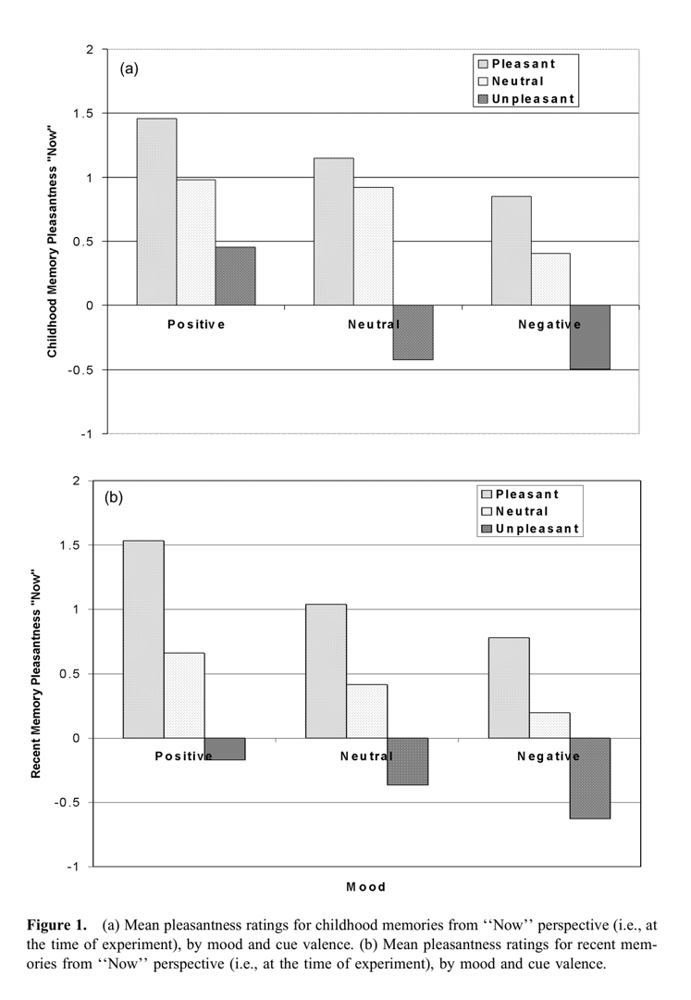

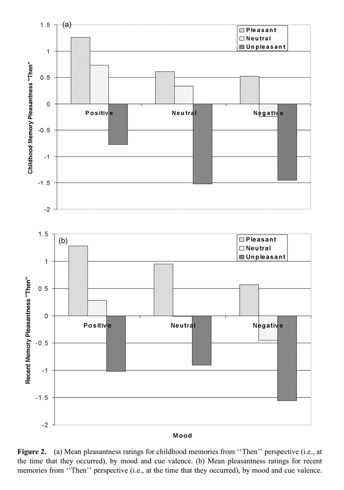 

:::

::: notes
En ordonnée, le jugement des souvenirs récupérés (-4 à +4), plus la barre est haute, plus le souvenir est jugé positif, plus elle est basse, plus il est jugé négatif. En abscisse, l’émotion du participant pendant la tâche de rappel.
En haut à gauche, on a le jugement des souvenirs d’enfance « maintenant », à droite les souvenir d’enfance et leur jugement à l’époque où les événements sont arrivés.
En bas à gauche le jugement des souvenirs récents maintenant et à droite lorsque les événements associés ont eu lieu.
Les barres gris clair correspondent aux souvenirs induits par les mots neutres, les barres gris moyen aux souvenirs induits par les mots agréables  et les barres gris foncé aux souvenirs induits par les mots désagréables.

Les trois conditions issues de l’induction musicale sont en abscisse : condition positive (musique joyeuse), condition neutre (musique neutre) et condition négative (musique triste)
:::

## Miranda & Kihlstrom (2005) {.scrollable}

- Les participants jugent + agréables les souvenirs + sous émotion +
- Plus (+) désagréables les souvenirs – sous émotion –
- Les souvenirs neutres sont jugés :

    - plus (+) agréables sous émotion +
    - moins (-) agréables sous émotion –
  
- => Effet de congruence affective sur le jugement de valence émotionnelle des souvenirs

## Effets de congruence affective sur la mémoire et le jugement des souvenirs

- Un état émotionnel – nous amène à encoder, à maintenir et à rappeler plus de souvenirs et d’informations négatives
- On va juger ces informations et souvenirs comme encore plus négatifs

- Dans un état de tristesse, les jugements et souvenirs tristes nous rendent tristes et nous maintiennent dans la tristesse 
- Cela fonctionne de la même façon pour la joie (récupération de souvenirs joyeux, jugés encore plus joyeux et maintien de l’état de joie)

## Effets de dépendance aux contextes émotionnels {.scrollable}

- Effets de contexte testés depuis longtemps en psychologie cognitive de la mémoire

  - Informations mieux rappelées si les contextes d’encodage et de rappel sont les mêmes que s’ils diffèrent
  - Ex : Godden & Baddeley (1975), Robin et al. (2020)
  - L’environnement physique joue un rôle 

- Est-ce que le rappel est meilleur quand on ressent la même émotion pendant l’encodage et pendant la récupération en mémoire ?

  - Est-ce que l’environnement émotionnel joue aussi un rôle ?

::: notes
Godden & Baddeley (1975) : les plongeurs qui apprennent une liste de mots en plongée se rappellent mieux celle-ci sous l’eau que sur la plage
Robin et al. (2020) chez des bilingues créole/français : rappel de mots en créole n’est pas impacté par le stress thermique (chaleur) alors qu’il l’est pour les mots en français (-> rappel de mots français meilleur à température de 20 degrés qu’à 30). RMQ : réplications diverses, consensus sur effet réel mais dépendant de plusieurs facteurs et question de la taille de l’effet
:::

## Dépendance aux contextes émotionnels {.scrollable}

Eich et al. (1994)

- Lecture de mots inducteurs neutres/ induction musicale (joyeuse ou triste)

  - Pour chaque mot, le participant rappelle un souvenir (daté, situé, quelques détails)
  - Condition contrainte : l’expérimentateur demande de rappeler un souvenir positif ou négatif pour chaque mot
  - Condition non contrainte : le participant rappelle le souvenir de son choix pour chaque mot inducteur

- Récupération en mémoire des souvenirs choisis lors de l’encodage

  - Dans le même état émotionnel (induit par la musique) ou pas 
  - À 2 jours et à 7 jours

::: notes
RMQ : mesure contrôle de l'état émotionnel par l'induction musicale
:::

## Eich et al. (1994) {.scrollable}

:::: {layout-col=2}

::: {#first-column}

- Meilleur taux de rappel quand le contexte émotionnel est le même pour l’encodage et le rappel à 2 jours, contrainte ou non sur la valence du souvenir à rappeler
- Mais la différence s’estompe avec le temps et disparaît à 7 jours

:::

::: {#second_column}

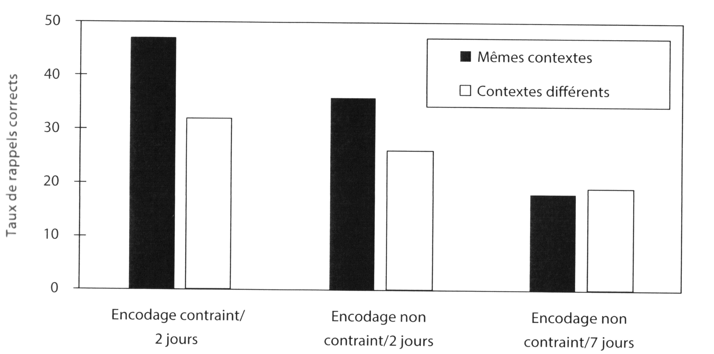

:::

::::

## Effet tunnel {.scrollable}

- Lors d’une émotion forte (agression par exemple), on se souvient parfaitement de certaines informations et on en oublie d’autres

- Sélectivité mnésique

    - Memory narrowing (e.g., Reisberg & Heuer, 2004), 
    - Tunnel memory (Safer, Christianson, Autry, & Osterlund, 1998), 
    - Memory trade-off effect (e.g., Kensinger, Garoff-Eaton, & Schacter, 2007)
- Encodage prioritaire des informations directement liées à l’émotion (ex : arme)
- Moins bon encodage des éléments périphériques

::: notes
1. Memory narrowing
Concept général (souvent utilisé comme terme “parapluie”)
Décrit le fait que l’émotion :
renforce la mémoire des éléments centraux
altère la mémoire des éléments périphériques
C’est l’idée globale que la mémoire “se rétrécit” autour de ce qui est émotionnellement saillant.

2. Tunnel memory
Souvent utilisée dans des contextes de stress ou situations émotionnelles intenses (ex : témoins d’un crime)
attention = un tunnel et focalisation forte sur un élément central (ex : une arme)
perte des détails périphériques

Très proche du memory narrowing, mais : plus centrée sur l’attention et
souvent associée à des situations écologiques (réelles)
3. Memory trade-off effect
Concept plus expérimental et quantifié
Met l’accent sur le compromis mesurable :

gain de mémoire pour les éléments émotionnels
perte pour les éléments neutres associés

Typiquement observé dans des paradigmes labo :
ex : objet émotionnel sur fond neutre
bon rappel de l’objet
mauvais rappel du contexte

:::

## Effet de trade-off en mémoire

Kensinger et al. (2007)

- Images avec un objet central dans un environnement neutre
- Objet central 

    - Neutre : voiture, écureuil
    - Émotionnel : voiture accidentée, serpent

- Chaque participant voit 64 images pendant 2s/image (exp1) ou 5s (exp2)
- Tâche simple de jugement : approcheriez-vous de la scène ? (1-7 points)

::: notes
le partipant ne voit qu'une des images de la planche présentée en exemple. Les autres images sont des variations.
:::

## Kensinger et al. (2007) - Méthodologie

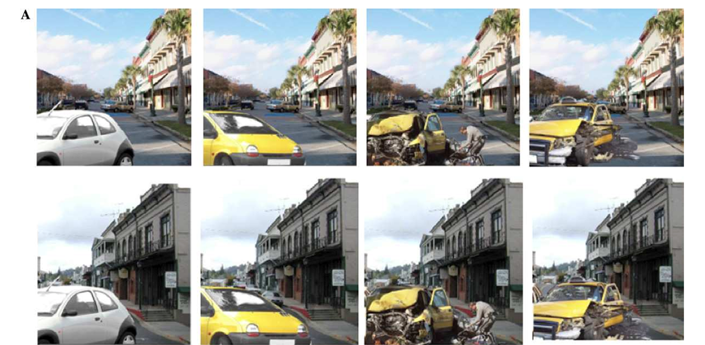

## Kensinger et al. (2007) - Méthodologie

- 30 minutes après, tâche de reconnaissance des éléments isolés 

    - 16 éléments identiques (même écureuil), 16 semblables (écureuil mais pas celui de l’image encodée), 16 différents (lapin)
    - 16 environnements identiques, 16 semblables, 16 différents

- 4 expériences

    - exp1 : 2s/image pendant l’encodage
    - exp 2 : 5s/image pendant l’encodage
    - exp 3 : 5s/image + raconter une histoire sur la scène vue
    - exp 4 : 5s/image + décrire la scène pour un artiste 

::: notes
le participant doit juger si ce qu'on lui présente est identique, semblable ou différent. On ne lui présente plus les scènes complètes mais des éléments isolés.
:::

## Kensinger et al. (2007) - Méthodologie

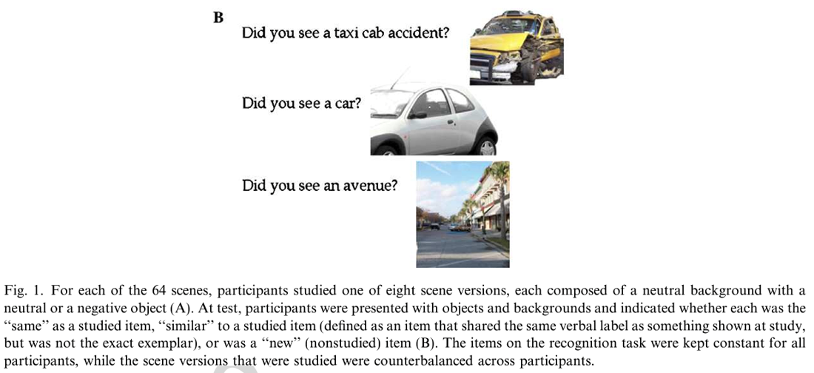

## Kensinger et al. (2007) - Résultats {.scrollable}

:::: {layout-col=2}

::: {#first-column}
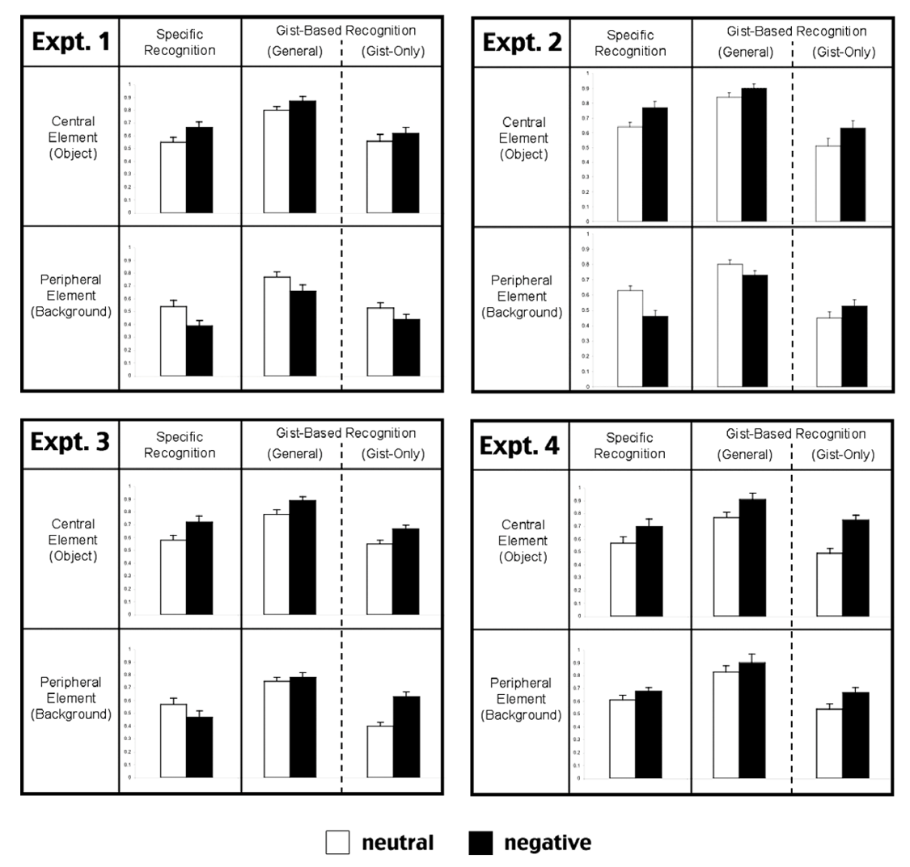

:::

::: {#second-column}

- *Specific Recognition* : reconnaissance des détails (ex : écureuil spécifique, avenue spécifique)
- *Gist (General)* : reconnaissance du thème général au moins (ex : animal ou avenue + semblables comme un écureuil différent ou une avenue différente)
- *Gist Only* : reconnaissance du thème général uniquement (ex : animal mais sans savoir lequel)

:::
::::

## Kensinger et al. (2007) - Résultats {.scrollable}

- Objets centraux négatifs mieux reconnus que les objets centraux neutres

    - Quel que soit le temps d'encodage
    - Quelle que soit la stratégie d'encodage utilisée
    
- Exp 1, 2, 3 : 

    - Phénomène de trade-off centre/périphérie dans la reconnaissance spécifique des éléments
    - Meilleure mémorisation des objets centraux émotionnels aux dépens des objets périphériques
    
- Exp 4 : 

    - Pas de trade-off centre/périphérie dans la reconnaissance spécifique des éléments

- Pas d'automaticité du phénomène de trade-off

    - Modularité 
    
::: notes
Reparler de l'importance de la méthodologie : la documenter pour la reprodctibilité et pour le raisonnement. Construction de la méthodologie à partir de la revue de littérature et non en premier
:::

## Conclusion sur émotion et mémoire

- Les émotions modifient nos performances mnésiques

    - Amélioration
    - Détérioration

- Effet de congruence affective entre l’encodage et le rappel

- Effet tunnel : focalisation attentionnelle sur l’information émotionnelle qui dégrade la mémorisation des autres informations

::: notes
Rappel : amélioration de la performance mnésique quand le matériel est émotionnel et que l'attention est dirigée vers celui-ci, diminution de la performance quand les participants sont dans un état émotionnel négatif. 
Effet de congruence affective sur le jugement des souvenirs/évenements aussi.
Beaucoup de facteurs et des interactions qui soulignent l'importance de réfléchir sa méthodo à partir de la littérature et de la documenter.
:::

# Partie 4 : Effets de la régulation émotionnelle sur les performances cognitives

## Plan de la partie 4 - Régulation émotionnelle

- Définition
- Stratégies de régulation émotionnelle
- Efficacité de la régulation émotionnelle
- Régulation émotionnelle et performances cognitives

# Régulation émotionnelle : Définition

## Régulation émotionnelle 

- Fait référence à l’influence de nos émotions ou de celles des autres
- Gross (1998)

    «processus par lesquels les individus influencent quelles émotions ils ressentent, quand ils ressentent ces émotions, et quelles expériences ils en ont, ainsi que comment ils expriment ces émotions» (p.275)

::: notes
Commencer par un exemple : bof/ ou exemple du rire lors des enterrements
Un personnage qui se promène et rencontre un chien. Type : passage de peur à colère que le chien ne soit pas tenu en laisse
Moment : en examen, on va faire en sorte de décaler le moment où on est stressé à avant ou après
:::

## Régulation émotionnelle

Repose sur un ensemble de mécanismes pour modifier :

- Le type et la durée de l’émotion ressentie
- Le moment où l’émotion est ressentie
- L’expérience (ou l’intensité) subjective de l’émotion ressentie
- La manière d’exprimer l’émotion ressentie/vécue

::: notes
ex : un collègue critique votre travail dans le groupe. Modifier le type d'émotion : l'émotion négative liée à la vexation de la critique -> émotion positive liée à la motivation d'améliorer pour avoir une bonne note
Limiter la durée pour se focaliser de nouveau sur le travail.
Prendre moins pour soi (comprendre que le reste du groupe est stressé par exemple)
Ne pas se montrer agressif 
Ou exemple de la mère de Jason en ESS
:::

## Régulation émotionnelle

- Lorsqu’une émotion est évaluée
- Que l’évaluation nous donne envie de modifier l’émotion
- Émotion désagréable ou non appropriée à la situation ou à nos objectifs
- Évaluation déclenche l’envie (ou le but) consciente ou non de la modifier

    => Mobilise une évaluation de l’évaluation
    

## Régulation émotionnelle, coping, régulation de l’humeur {.scrollable}

Coping

- Focalisé sur la diminution des affects négatifs
- Mis en œuvre sur de plus longues périodes que la RE

Régulation (ou réparation) de l’humeur

- Focalisée sur la modification de l’expérience (subjective) émotionnelle et non sur le comportement émotionnel

::: notes
Coping : affects négatifs uniquement alors que RE non (par exemple, RE pour cacher un rire quand quelqu’un tombe)

Régulation de l’humeur : on va chercher à être globalement plus positif par exemple, à la différence de la RE qui intervient en réaction à un comportement émotionnel dans une situation donnée
:::

## Composantes fondamentales de la RE

3 composantes (Gross, 2014) : 

- But
- Stratégies
- Résultat

## Composantes fondamentales de la RE - But

- Ce que le participant essaie de réaliser 

    Ex : diminuer une émotion négative

- Représentation cognitive d’un état émotionnel final
- Activation d’un but pour modifier le déclenchement d’une émotion

    **=> Régulation intrinsèque (déterminée par l’individu) ou extrinsèque (déterminée par un agent extérieur)**

::: notes
Exemple du chien : diminuer sa peur face au chien. On active un but (être tranquille - passer tranquillement pour ne pas énerver le chien ou pour que les amis ne voient pas la peur) pour modifier le déclenchement d’une émotion.
Il semble qu’on souhaite globalement tous réduire les émotions négatives et augmenter les émotions positives mais pour autant,
Tout le monde n’a pas le même but dans une même situation. Ex: on peut vouloir apaiser la colère ou au contraire, la garder intense.
Ex de régulation intrinsèque : retenir sa colère, effacer un sourire lors d’un enterrement, …
Extrinsèque : calmer un enfant, apaiser la tristesse de quelqu’un, raconter une blague pour faire rire
:::

## Composantes fondamentales de la RE - But

Deux approches de la RE

- Approche hédonique de la régulation des affects (Larsen, 2000)
- Approche instrumentale de la RE (Tamir, 2009) 

::: notes
Hédonique : ce qui va nous faire du bien. nous sommes motivés pour diminuer la peine à court terme et augmenter le plaisir/bien-être 
Instrumentale : nous sommes motivés à RE pour mieux réaliser un autre but 
:::

## Composantes fondamentales de la RE - Stratégies

- Comment le participant essaie d’atteindre son but
- Utilisation de processus pour modifier la trajectoire émotionnelle

    - Variation des processus
    - Processus explicites, conscients, mobilisés de manière contrôlée
    - Processus implicites, inconscients, mobilisés de manière automatique

::: notes
On les développera plus loin, mais pour l’instant, ce que l’on peut noter, c’est que ces processus peuvent varier
:::

## Composantes fondamentales de la RE - Résultat {.scrollable}

- Conséquences de la régulation émotionnelle

    - Modification ou non d’une émotion
    - Quels résultats de la stratégie utilisée par rapport au but poursuivi ?

- Impact de la stratégie de régulation émotionnelle sur différents indicateurs

    - Latence de déclenchement,
    - Durée, 
    - Intensité, 
    - Début/fin de la réponse (comportementale, physiologique) de l’organisme

# Stratégies de régulation émotionnelle

::: notes
Rappelons qu’une émotion survient lorsque nous nous trouvons dans une situation ou face à un stimulus que nous évaluons (son caractère dangereux ou pas, ou son caractère agréable/désagréable) et peut s’exprimer à différents niveaux (depuis les manifestations physiologiques, comme l’accélération du rythme cardiaque, jusqu’aux niveaux psychologiques et comportementaux, comme un ressenti subjectif de peur et une fuite). Une fois déclenchée, avant ou après avoir été déclenchée, une émotion peut être modifiée par différentes stratégies. Les stratégies de régulation émotionnelle peuvent être distinguées sur plusieurs critères, comme par exemple les étapes d’une expérience émotionnelle (e.g., Gross, 1998), sur le fait que la stratégie implique une action physique ou une action cognitive (e.g., Parkinson & Totterdell, 1999), ou sur le fait que la régulation cible un processus, comme l’attention au stimulus, une information sur la nature des informations contenues dans le stimulus déclencheur de l’émotion, ou sur une manifestation physique de l’émotion ou bien encore selon que le but de la régulation est l’augmentation/diminution du bien-être ou mal-être associé à une émotion ou d’améliorer une performance cognitive ou des relations sociales ou, plus généralement, atteindre un objectif à plus long terme (Koole, 2009; Tamir, 2009). Au-delà de différences sur la base desquelles faire une distinction entre plusieurs stratégies, les différentes distinctions proposées partagent un certain nombre de postulats, comme le fait qu’il existe un répertoire varié de stratégies de régulations émotionnelles, qu’un individu ne mobilise pas nécessairement qu’une seule stratégie même s’il peut avoir des préférences, et le fait que les différentes stratégies n’ont pas le même niveau d’efficacité dans différents contextes. L’une des distinctions les plus utilisées dans la littérature est celle proposée par Gross et ses collègues.
:::

## Répertoire de stratégies de régulation émotionnelle - Modèle de Gross (1998)

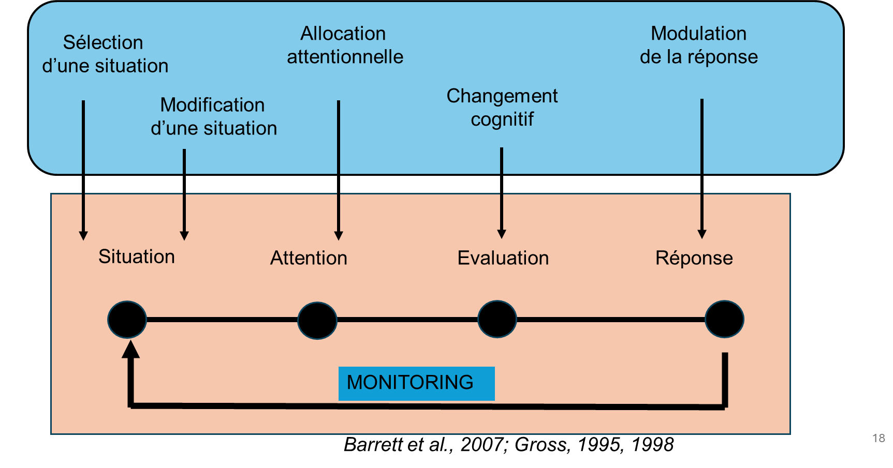

::: notes
Selon le modèle de la régulation émotionnelle qu’ont proposé Gross et ses collaborateurs (e.g., Gross, 1995, 1998; Gross & Thompson, 2007), la régulation émotionnelle peut intervenir à plusieurs niveaux, à commencer par la situation qui déclenche une émotion, qu’il peut sélectionner ou modifier, ce qui va permettre de déclencher ou d’éviter une émotion). Ainsi, un participant peut choisir de se retrouver ou pas dans une situation dont il sait qu’elle déclenche une émotion ou au contraire choisir une situation qu’il sait déclencher chez lui une certaine émotion (e.g., le participant peut éviter les chiens s’il a peur des chiens, éviter une voisine grincheuse et dont les plaintes ne sont pas agréables, se rendre chez des amis pleins d’humour, ou encore monter dans un manège à sensation si cela lui procure du plaisir). 
Le participant peut également modifier une situation dans laquelle il se retrouve et qui active en lui une émotion qu’il aurait envie de modifier (e.g.,  suggérer un jeu de société au cours d’une soirée ennuyeuse, y raconter une blague ou lancer un débat politique). 
Une autre famille de stratégies de régulation émotionnelle peut être mise en œuvre au moment où le participant alloue des ressources attentionnelles au traitement de la situation ou du stimulus déclencheurs d’une émotion. Il peut ainsi utiliser une stratégie de distraction en détournant son attention d’un stimulus émotionnel ou allouer une attention moindre à ce stimulus (e.g., à la vue d’une araignée, le participant qui a horreur des araignées détourne son attention d’une araignée qu’il vient d’apercevoir, pense à quelque chose d’émotionnellement neutre, ou repense à des amis ou des proches qui lui sont chers). 
Le participant peut également utiliser rumination (e.g., un participant peut ruminer un souvenir triste, repenser intensément à une très bonne nouvelle qu’il vient de recevoir) ou une focalisation attentionnelle sur le ressenti (e.g., le participant prête une très grande attention à ce qu’il ressent). 
Par ailleurs, un participant peut réguler ses émotions grâce à un traitement cognitif ou une réévaluation cognitive de la situation et de l’émotion ressentie. Cette réévaluation cognitive comprend plusieurs stratégies qui ont toutes pour point commun de permettre de réinterpréter ou ré-évaluer la signification, ce qui aboutit à lui donner une autre signification, après avoir modifié la manière d’appréhender la situation, la signification émotionnelle de cette situation, ou envisager une autre manière de la gérer. Accepter la situation et l’émotion qui va avec, comme après un deuil, est un exemple de l’une de ces stratégies de réévaluation cognitive, se rendre compte que la colère de quelqu’un n’était pas dirigée contre soi est un autre exemple. Enfin, la dernière catégorie de stratégie de régulation émotionnelle concerne la réponse ou l’expression de l’émotion et consiste à tenter d’infléchir l’expression d’une réponse (comportementale, physiologique) émotionnelle déjà engagée. Ainsi, prendre une respiration profonde, de l’alcool ou autre substance (tabac, nourriture), ne pas exprimer sa colère constituent des exemples de stratégie de régulation émotionnelle aboutissant à modifier notre réponse émotionnelle à une situation.
:::

## Résumé des types de stratégies de RE - Modèle de Gross (1998) {.scrollable}

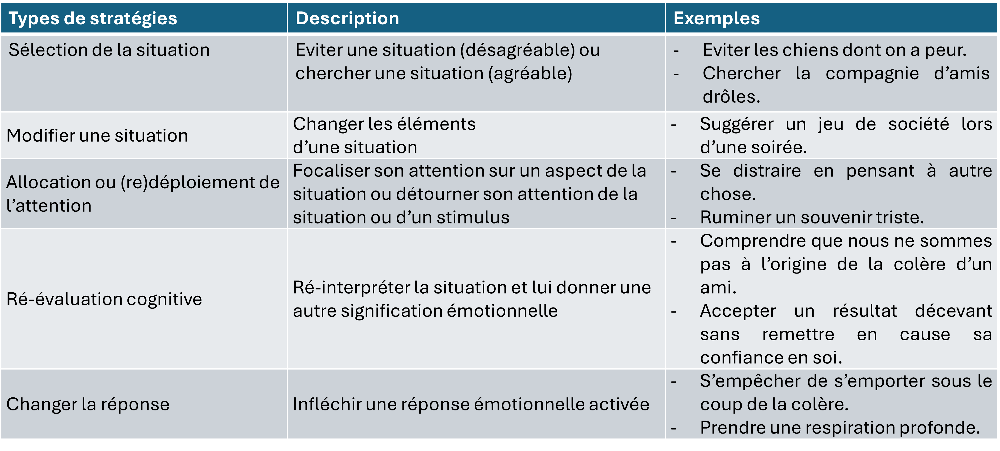

::: notes
Stratégies issus du modèle de Gross (1998), mais d'autres stratégies de RE ont été identifiées et n'apparaissent pas dans ce modèle. Ce modèle s'intéresse surtout aux stratégies cognitives et intrapersonnelles orientées vers la modification de l'émotion. 

Redéploiement de l'attention = distraction

Changer la réponse -> suppression (=inhiber les expressions des émotions)
::: 

## D'autres stratégies de RE

- Acceptation
  
    - laisser exister l'émotion sans chercher à la changer 
    
- Suppression cognitive

    - essayer de ne pas penser à une situation, à un problème par exemple 

- Stratégies interpersonnelles

    - recherche de soutien, partage social des émotions, réassurance, co-régulation

- Stratégies physiologiques

    - respirer profondément, cohérence cardiaque

# Utilisation des stratégies de régulation émotionnelle

Quand utilise-t-on les stratégies de régulation émotionnelle ?

## Quand les stratégies de RE sont-elles utilisées ?

- Est-ce qu’on met en œuvre certaines stratégies de RE plus souvent que d’autres ?
- Quels sont les déterminants de l’utilisation des différentes stratégies ?

::: notes
De nombreux travaux empiriques se sont focalisés sur ces questions.
:::

## Quand les stratégies de RE sont-elles utilisées ?

=> Variabilité de la fréquence de la stratégie en fonction 

- de l’intensité de l’émotion
- du type d’émotion à réguler
- du temps disponible pour réguler
- de la difficulté d’une stratégie de régulation
- du but émotionnel poursuivi 
- du fait de savoir à l’avance ou non si on va devoir réguler

## 3 exemples d’études 

Études qui montrent comment l’utilisation des stratégies de régulation émotionnelle varie selon 

- L’intensité émotionnelle
- Le but poursuivi par les participants
- Le contexte

## Rôle de l’intensité émotionnelle {.scrollable}

:::: {layout-col=2}

::: {#firstcolumn}

Sheppes et al. (2011)

- Cherchent à évaluer les choix stratégiques des participants pour réguler leurs émotions
- Expérience 1

    - 30 essais : image émotionnelle (intensité faible ou forte) pendant 500 ms
    - Les participants devaient dire s’ils avaient encodé l’image avec une **stratégie de distraction** ou une **stratégie de ré-évaluation cognitive**
    
:::

::: {#secondcolumn}

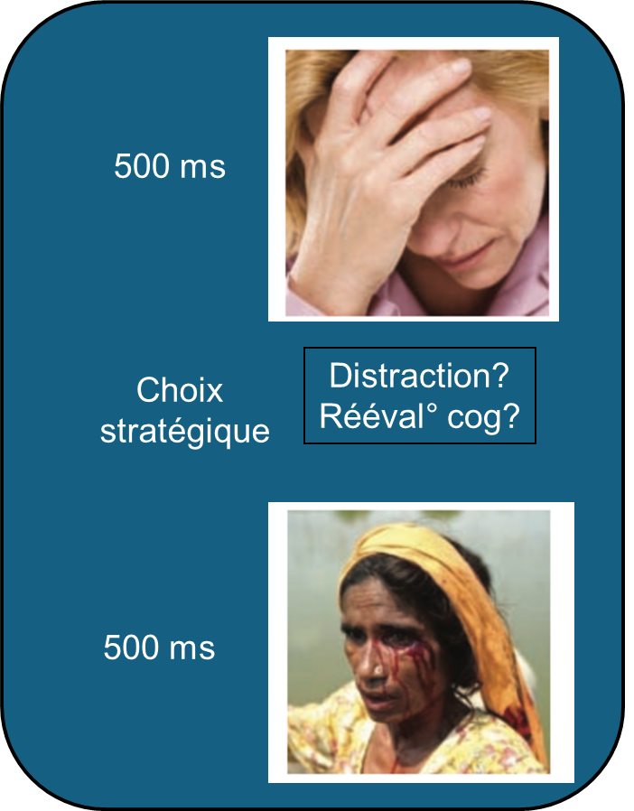

:::

::::

::: notes
Rôle de l’intensité émotionnelle dans l’utilisation des stratégies de RE

stratégie  de distraction (penser à quelque chose de neutre) ou une stratégie de ré-évaluation cognitive (penser à l’image comme si elle montrait quelque chose de neutre ou de moins négatif). 
:::

## Rôle de l’intensité émotionnelle {.scrollable}

:::: {layout-col=2}

::: {#firstcolumn}
Sheppes et al. (2011)

- Expérience 2

    - 20 chocs électriques au bras gauche
    - Participants prévenus pour chaque choc de l’intensité du choc (faible/fort)
    - Participants indiquent s’ils ont utilisé une stratégie de distraction ou de ré-évaluation cognitive 

:::

::: {#secondcolumn}

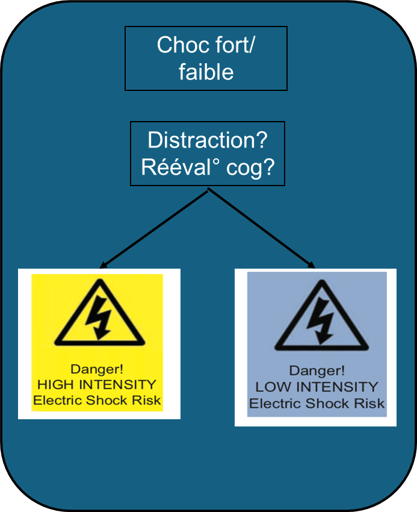

:::

::::

::: notes
Rôle de l’intensité émotionnelle dans l’utilisation des stratégies de RE

Dans une 2ème expérience, les participants recevaient 20 chocs électriques au bras gauche, après avoir été prévenus pour chaque choc si ce choc allait être de faible ou de forte intensité. Ils devaient indiquer pour chacun des chocs s’ils avaient utilisé une stratégie de distraction ou de réévaluation. 
:::

## Rôle de l’intensité émotionnelle – Sheppes et al. (2011)

- Même pattern de résultats pour les images et les chocs électriques
- Plus l’intensité du stimulus augmente, moins la ré-évaluation cognitive est utilisée
- Stimulus faible -> ré-évaluation cognitive + fréquente
- Stimulus fort -> distraction plus fréquente

## Rôle de l’intensité émotionnelle – Sheppes et al. (2014), Shafir et al. (2015) {.scrollable}

- Choix de la **distraction** pour minimiser l’émotion négative sur une image **à court terme**
- Choix de la **ré-évaluation cognitive** pour minimiser l’effet **à long terme** (ex : s’ils revoient l’image plus tard)

- **la stratégie de ré-évaluation cognitive est choisie**

    - quand l’intensité de l’émotion est moins intense
    - quand elle a un bénéfice plus grand à long terme

- Elle permet un désengagement émotionnel plus efficace à long terme  
- Distraction : désengagement émotionnel à court terme mais fonctionne sur des émotions intenses

## 3 exemples d’études 

Études qui montrent comment l’utilisation des stratégies de régulation émotionnelle varie selon 

- ~~L’intensité émotionnelle~~
- **Le but poursuivi par les participants**
- Le contexte

::: notes
Rappel : on a vu que selon l’intensité émotionnelle de l’événement, la ré-évaluation cognitive ou la distraction pouvaient être choisies. La fréquence de l’une ou de l’autre dépendait de l’intensité émotionnelle mais aussi du fait de réguler à court ou long terme. 
Nous allons à présent voir que l’utilisation des stratégies de régulation émotionnelle varie selon le but poursuivi par les participants.
:::

## Rôle du but émotionnel dans la sélection stratégique en régulation émotionnelle

Millgram et al. (2019)

- Présentation d’images positives (20, joyeuses) et négatives (20, tristes)
- Avant chaque image : consigne d’amplifier OU de diminuer l’émotion ressentie à l’encodage de l’image
- Après chaque image : dire si pour atteindre ce but, ils avaient utilisé la distraction ou la rumination

::: notes
Stratégie de distraction : penser à autre chose qu’à l’image
Stratégie de rumination : rester focalisé sur l’image et se concentrer sur leur émotion
:::

## Rôle du but émotionnel dans la sélection stratégique en RE - Millgram et al. (2019) {.scrollable}

Pourcentage d’utilisation des stratégies de rumination et de distraction en fonction du but émotionnel poursuivi sur des images tristes ou joyeuses

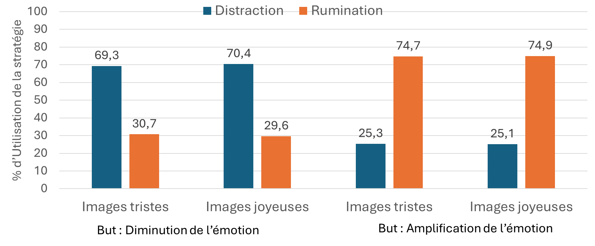

::: notes
Ajustement de la stratégie par rapport au but émotionnel. Distraction pour réduite l’émotion et rumination pour l’amplifier.
Un contrôle de l’état émotionnel montre que les stratégies utilisées avaient bien conduit au but demandé par la consigne. 
Stratégie de distraction : penser à autre chose qu’à l’image)
Stratégie de rumination : rester focalisé sur l’image et se concentrer sur leur émotion
:::

## Rôle du but émotionnel dans la sélection stratégique en RE - Millgram et al. (2019)

- Ajustement de la stratégie par rapport au but émotionnel

    - un contrôle de l'état émotionnel montre que les stratégies utilisées ont bien conduit au but demandé dans la consigne
    
- Distraction pour réduire l'émotion
- Rumination pour amplifier l'émotion
- pour les émotions positives comme négatives 

## 3 exemples d’études 

Études qui montrent comment l’utilisation des stratégies de régulation émotionnelle varie selon 

- ~~L’intensité émotionnelle~~
- ~~Le but poursuivi par les participants~~
- **Le contexte**

## Effet du contexte et utilisation stratégique { .scrollable}

McRae et al. (2011)

- Participants : N=2558 (54% d’hommes, $M_{\hat{A}GE}$=36, SD=11) 
- Recrutés au festival Burning Man
- 2 questions adaptées de l’ERQ Suppression scale et de l’ERQ Reappraisal scale (Gross & John, 2003) 

    - When I want to control my emotions, I do so by not expressing them (Suppression)
    - When I want to control my emotions, I do so by changing the way I think about the situation (Ré évaluation cognitive)

- Réponse au festival / à la maison

::: notes
Burning Man : festival artistique dans le désert du Nevada. Ville qui se construit. Pas d’argent sur place. Connu pour être un endroit où les gens disent se sentir eux-mêmes.

Echelles en 9 points pour les deux questions avec en 1- Not at all like me, au milieu Neutral et en 9- Very much like me. Emotion Regulation Questionnaire : ERQ
:::

## Emotion Regulation Questionnaire (Gross & John, 2003)

> Gross, J. J., & John, O. P. (2003). Individual differences in two emotion regulation processes: Implications for affect, relationships, and well-being. **Journal of personality and social psychology, 85**(2), 348-362. https://doi.org/10.1037/0022-3514.85.2.348

## Effet du contexte et utilisation stratégique { .scrollable}



::: notes
Burning Man : festival artistique dans le désert du Nevada. Ville qui se construit. Pas d’argent sur place. Connu pour être un endroit où les gens disent se sentir eux-mêmes.
Illustration de 2022 (Inondations en 2023)
:::

## Effet du contexte et utilisation stratégique

McRae et al. (2011)

- Hypothèse ?
- Les participants utilisent moins la suppression des émotions dans le cadre du festival que dans leur environnement classique

    - Les normes concernant l’expression des émotions dans les pays occidentaux ne sont pas aussi présentes dans le festival 
    
::: notes
Gross et John (2003) montrent que les hommes utilisent davantage la suppression que les femmes et que les blancs américains utilisent moins la suppression que les américains d'autres origines. Cette étude met en évidence un effet du genre et de l’origine sur l’utilisation de la suppression expressive, interprété par les auteurs comme reflétant une adaptation aux normes sociales et culturelles.
L'étude de McRae et al. (2011) cherche à étendre ces connaissances en étudiant des différences intra-individuelles avec l'effet du contexte sur l'utilisation de la suppression. 
:::

## Effet du contexte et utilisation stratégique - Résultat {.scrollable}

:::: {.layout-col=2}

::: {#firstcolumn}

McRae et al. (2011)

- La suppression est moins utilisée en contexte de festival que la ré évaluation cognitive

    **=> L’utilisation des stratégies de RE dépend du contexte**
    
:::

::: {#secondcolumn}

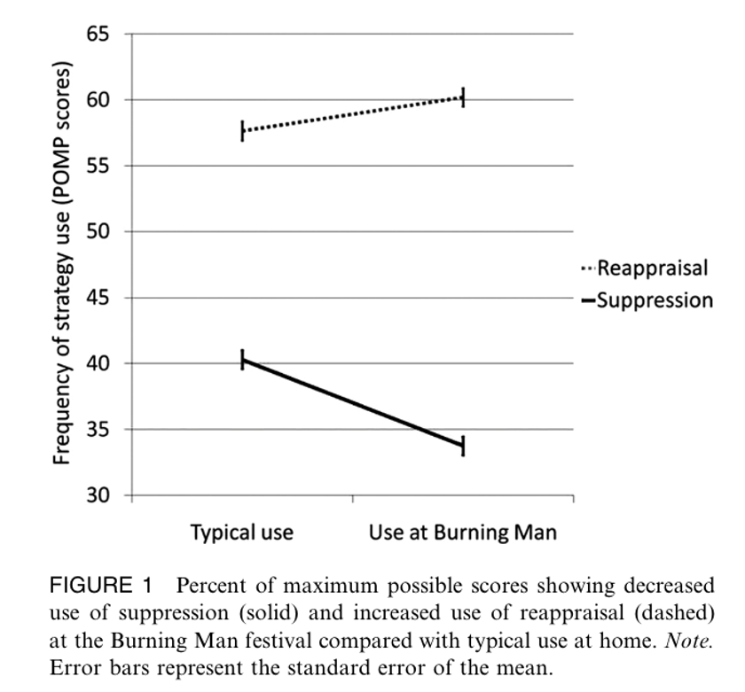

:::

::::

::: notes
En ordonnée la fréquence d’utilisation des stratégies, en abscisse les deux situations : dans l’environnement habituel/au festival. En pointillé la ré évaluation cognitive et en trait plein la suppression.

POMP : percent of maximum possible score. Permet de mettre deux scores qui ne seraient pas sur la même échelle (ex : score en 7 points et score en 9 points) dans le même graphique. Ce n'est pas le cas ici. 
Ici, l'intêret est de voir l'importance de l'utilisation. Le pourcentage indique si la stratégie est beaucoup ou peu utilisée. IL se calcule : (score moyen - score minimum) / (score max - score min) * 100
ex : rééval cognitive au burning man = 60 => ça ne veut pas dire que 60% des gens l'utilisent. Ca veut dire que le niveau d'utilisation moyen est de 60% du maximum possible. 
On peut retrouver le score moyen : (score moyen-1)/(7-1)x100=60, score moyen = (6*60/100)+1 = 4.6 (sur 7)
Permet de voir où se situe le score moyen d'utilisation de la stratégie sur une échelle de 0 à 100.
:::

## Conclusion - Utilisation de stratégies de RE

La fréquence d’utilisation des stratégies de régulation émotionnelle dépend 

- De l’intensité de l’émotion
- Du but de la régulation émotionnelle
- Du contexte 
- (entre autres !)

::: notes
ex de entre autres : genre, origine, pratique de la médiation de pleine conscience
:::

# Exécution des stratégies de régulation émotionnelle

Efficacité des stratégies

::: notes
Expliquer que dans les modèles théoriques sur les stratégies (notamment ASCM de Siegler & Shipley (1995)) on parle de répertoire de stratégies pour les stratégies utilisées (description), d’utilisation des stratégies pour la fréquence d’utilisation et d’exécution des stratégies pour l’efficacité des stratégies.  
:::

## Résultats de la régulation émotionnelle

- Dépendent de la stratégie utilisée
- Certaines stratégies sont plus efficaces dans certaines conditions
- D’autres régulent mieux nos émotions dans d’autres conditions
- Résultats de la RE au niveau affectif, cognitif, social (Webb, Miles, & Sheeren, 2012)

::: notes
On va aller regarder ces résultats sur 2 stratégies : la suppression expressive (suppression de l’émotion) et la ré-évaluation cognitive (envisager la situation de façon différente)
:::

## Efficacité relative de 2 stratégies de RE { .scrollable}

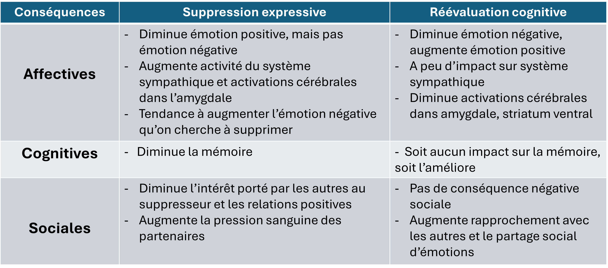

::: notes
Le système nerveux sympathique prépare le corps à des situations qui exigent de la force et une perception accrue ou qui éveillent la peur, la colère, l'excitation ou la gêne. C'est ce qu'on appelle la réaction de lutte ou de fuite.
:::

## Efficacité relative de 2 stratégies de RE - Gross (1998) {.scrollable}

Gross (1998)

- 3 films vus dans cet ordre par les participants (1 minute environ pour chaque film)

    - Baseline (film neutre)
    - Traitement d’un grand brûlé 
    - Amputation : 1 stratégie tirée au sort parmi 3

- 3 stratégies 

    - Suppression expressive : «Ne laisser apparaître aucune émotion»
    - Ré évaluation cognitive : «Essayer d’adopter une attitude non-émotionnelle et détachée en essayant de penser objectivement à la scène du film»
    - Contrôle : «Visionner le film»

::: notes 
Travaux pionniers. 
Les expérimentateurs vérifient que les participants ont utilisé les stratégies demandées. After the amputation film, three questions were administered to assess compliance with instructions. Compared with the watch participants, both suppression participants, ;(78) = 4.7, p < .001, and reappraisal participants, f(78) = 3.2, p < .01, reported reacting less spontaneously during the amputation film, consistent with their having been asked to regulate their emotions. As expected, reappraisal participants reported trying not to feel the emotion to a greater degree than watch participants, /(78) = 8.8,/? < .001, and suppression participants, r(78) = 2.2, p < .05. Also as expected, suppression participants reported feeling but hiding emotions to a greater degree than watch participants, ?(78) = 7.3, p < .001, and reappraisal participants r(77.7) = 2.0, p < .05
:::

## Gross (1998) - Mesures

- Comportementales (expressif) : réactions de dégoût (e.g., sur le visage), mouvements des lèvres 
- Expérience subjective : auto-évaluation émotionnelle avant/après le film (e.g., dégoût de 1 à 9)
- Physiologiques : volume de sang dans le doigt, température du doigt, conduction cutanée, temps entre deux battements de cœur 

## Gross (1998) - Résultats 

- Les barres représentent l'évolution du dégoût au cours de l'expérience (visionnage de la vidéo d'amputation)

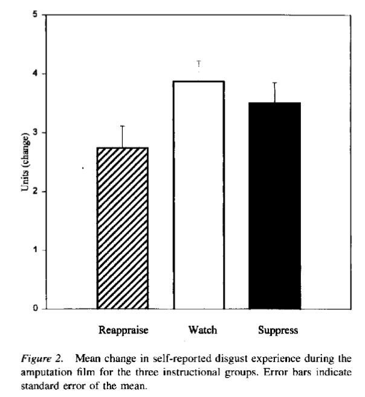

## Gross (1998) - Résultats données physiologiques

- Même pattern de résultats pour les différentes données physiologiques

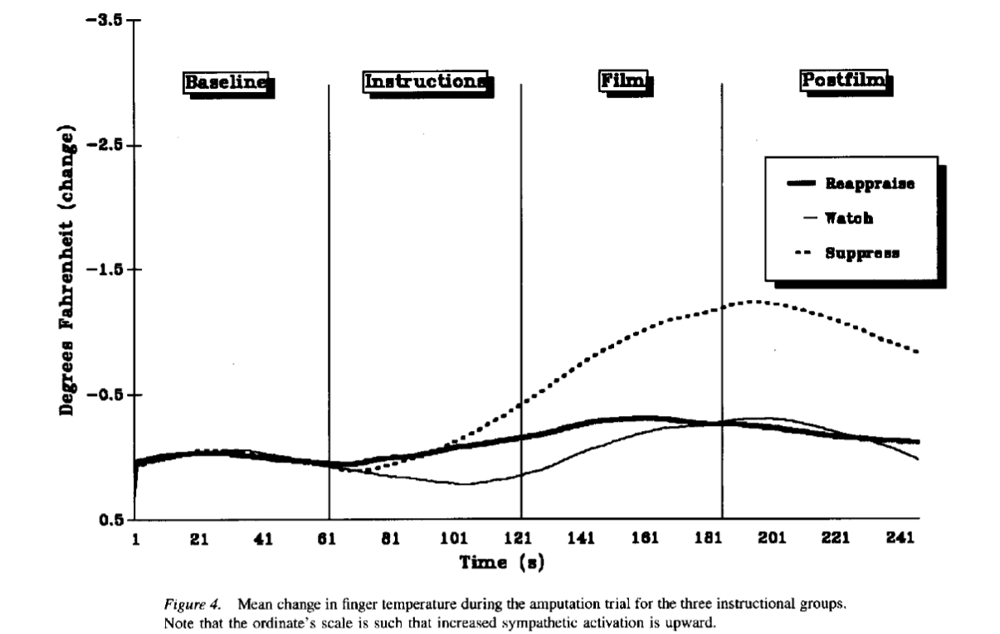

## Conclusions Gross (1998)

- Données comportementales et physiologiques vont dans le même sens 
- Modifications de la perception de l'émotion et des réponses physiologiques quand utilisation de RE, **MAIS différenciées selon la stratégie de RE**
- Ré évaluation cognitive plus efficace que suppression expressive sur l'expérience subjective
- Suppression expressive active le système sympathique alors que la ré évaluation cognitive, non

::: notes
donner des exemples. S'il faut préserver son expérience subjective, alors préférer la réévaluation cognitive, mais s'il faut se sauver ou combattre, préférer la suppression expressive
:::

# Rôle de l'intensité émotionnelle sur l'exécution stratégique

En quoi l’intensité émotionnelle impacte-t-elle l’efficacité des stratégies de RE ?

::: notes
Comme pour l’utilisation des stratégies, plusieurs paramètres, dont l’intensité de l’émotion influencent l’exécution des stratégies (c’est-à-dire, dans la modélisation des stratégies, l’EFFICACITE des stratégies).
:::

## Efficacité en fonction de l’intensité émotionnelle - Shaffir et al. (2015) {.scrollable}

:::: {layout-col=2}

::: {#firstcolumn}

- 180 images

    - 90 intensité faible
    - 90 intensité forte

- 3 conditions

    - Contrôle
    - Distraction
    - Ré évaluation cognitive
    
::: 

::: {#secondcolumn}

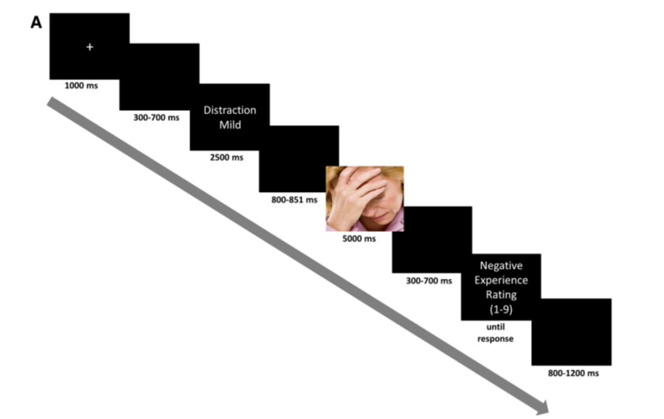
:::

::::

::: notes
Les stratégies sont imposées et le participant doit évaluer sur une échelle de 1 à 9 l’émotion ressentie.
:::

## Shaffir et al. (2015) - Résultats {.scrollable}

- Effet de la régulation émotionnelle

    - Reproduction de ce qui a été montré précédemment
    - Émotion ressentie – intense avec une stratégie de RE (ré évaluation cognitive ou distraction) que sans (contrôle)
    
- Effet de l'intensité émotionnelle : résultats différents selon l'intensité émotionnelle de l'image

- Images émotionnelles les + intenses : 

    - Émotion ressentie - négative quand ré évaluation cognitive que dans la condition contrôle
    - Émotion ressentie encore - négative quand distraction
    - Expérience subjective distraction > ré évaluation cognitive > contrôle
    
- Images émotionnelles les - intenses : 

    - Distraction et ré évaluation cognitive diminuent l'émotion négative dans des proportions comparables (+ que contrôle)
    - Expérience subjective distraction $\equiv$ ré évaluation cognitive > contrôle

# Régulation émotionnelle et performances cognitives

La RE améliore-t-elle ou détériore-t-elle les performances cognitives ?

## RE et performances cognitives

- La régulation émotionnelle peut dégrader les performances cognitives
- La régulation émotionnelle peut améliorer les performances

## Des effets différenciés selon l'intensité de l'émotion et la nature de la stratégie de RE : un exemple

Richards & Gross (2000)

- 2 expériences

- 1/ Clip vidéo de 140 secondes
Condition 1 : contrôle – regarder la vidéo
Condition 2 : + suppression expressive (ne rien laisser paraître)
Test mémoire : 24 questions (QCM) sur le contenu de la vidéo

::: notes
Plusieurs études ont observé que la régulation émotionnelle pouvait entrainer une diminution des performances mnésiques (e.g., Johns, Inzlicht, & Schmader, 2008; Richards, Butler, & Gross, 2003; Richards & Gross, 1999, 2000, 2006). 
Dans une première expérience, ils montraient un clip video de 140 s à leurs participants, soit dans une condition contrôle, sans régulation émotionnelle (i.e., les participants avaient pour consigne de simplement regarder la video), soit dans une condition de régulation émotionnelle par suppression expressive (i.e., les participants devaient ne rien laisser paraître de leurs émotions déclenchées par les diapositives, de sorte à ce qu’un observateur extérieur ne puisse détecter leur émotion d’après l’expression de leur visage). Après avoir vu le clip video, les participants avaient 24 questions testant leur mémorisation d’informations relatives au contenu du clip video. 
:::

## Richards & Gross (2000) - Expérience 1

73% de bonnes réponses dans la condition contrôle
64% de bonnes réponses dans la condition de régulation émotionnelle avec suppression expressive

- Les ressources allouées à la suppression expressive ne semblent pas disponibles pour la mémorisation d’informations 
- Moins bonnes performances au rappel

## Richards & Gross (2000) – Expérience 2

- Encodage : 18 diapos d’hommes +/- blessés + informations verbales sur ces hommes données par l'expérimentateur
- Condition 1 : regarder les diapos
- Condition 2 : + suppression expressive (ne rien laisser paraître)
- Condition 3 : + ré évaluation cognitive (les regarder comme si on était un médecin)
- Rappel verbal et non verbal des informations des diapos

::: notes
Les participants étaient informés du nom et de la profession de chaque homme et du fait que chacun de ces hommes avaient eu une blessure par le passé. Dans une première condition, les participants avaient pour consigne de bien regarder chaque diapo et écouter les informations associées à chacune d’elles (condition contrôle). Par ailleurs, les participants devaient en plus ne laisser transparaître aucune émotion déclenchée par chaque diapo dans une seconde condition (de suppression expressive) ou devaient regarder chaque diapositive avec de la distance comme s’ils étaient un professionnel du corps médical  dans une dernière condition (de ré-évaluation cognitive). Lorsque les participants devaient rappeler les informations associées à chaque diapositives, le taux de rappels correct était meilleur en condition contrôle (18.6 informations rappelée sur les 36), qu’en condition de ré-évaluation cognitive (16.4) et le moins bon en condition de suppression expressive (13.0). 
:::

## Richards & Gross (2000) – expérience 2, résultats { .scrollable}

Taux de rappel correct moyen pour les informations **verbales**

- En condition contrôle : 18,6/36
- En condition ré évaluation cognitive : 16,4/36
- En condition suppression expressive : 13/36

- **Baisse des performances mnésiques** quand RE, différenciée selon la stratégie de RE pour les **informations verbales**

- Mais motif différent pour les informations **non verbales**  
- Quand émotion faible : 
    
    - informations non verbales mieux rappelées en condition contrôle > ré évaluation cognitive > suppression expressive
    
- Quand émotion forte : 

    - informations non verbales mieux rappelées en condition ré évaluation cognitive > suppression expressive > contrôle
    
- **Résultats variables selon l'intensité de l'émotion et le type d'informations à rappeler**

# Merci ! 

