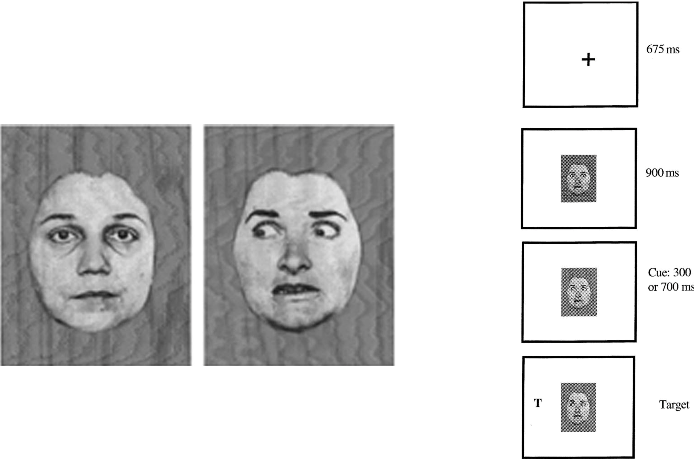
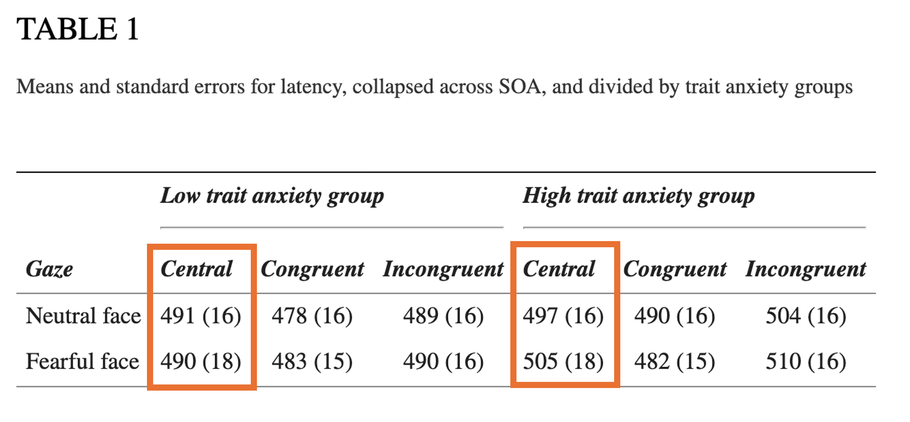
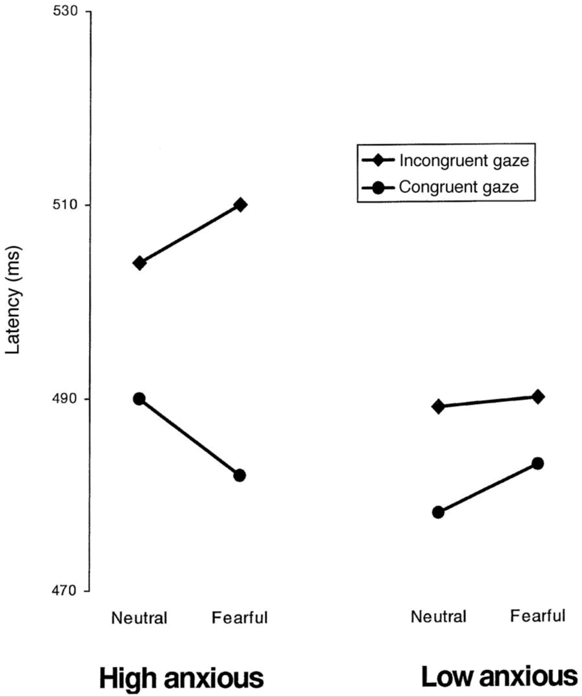

# Présentation du cours

## Objectifs du cours

-   Définir les émotions
-   Comprendre comment les émotions influencent les processus cognitifs (attention/mémoire/raisonnement)
-   Comprendre comment les processus cognitifs peuvent moduler les expériences émotionnelles (régulation émotionnelle)
-   Examiner les différences individuelles dans ces processus et les interactions

## Répartition des tâches

Cours :

‒ Apporter des connaissances générales et méthodologiques sur l’étude des relations entre émotion et cognition

Étudiant.e :

‒ Mettre en relation ces connaissances et un champ de recherche à choisir (e.g., vieillissement, apprentissages, développement de l’enfant, orientation) 

## Évaluation du cours 

‒ Sujet type cadre théorique dans une réponse à un AAP/ abstract (sans les résultats) en un nombre de mots donné

[exemple p.31](https://jipd-2018.sciencesconf.org/data/pages/Organisation_Horaires_23e_Journees_Internationales_de_Psychologie_Differentielle.pdf) 

‒ Critères de réussite : 

    - Sélection et mise en lien de notions apprises en cours 
    - Fluidité et lisibilité de la rédaction 
    - Apports de sa recherche personnelle sur le sujet (lectures complémentaires)

::: notes
éviter les catalogues, juxtaposition, récitation de cours
:::

## Source Principale

‒	Lemaire, P. (2021). *Émotion et cognition: Série LMD*. De Boeck Supérieur.

## Plan de la première partie du cours

**Introduction**
=> Quelles questions en psychologie sur le lien entre émotion et cognition ? 

**Définition des émotions**
=> Modèles théoriques

**Comment étudier le lien entre émotion et cognition ?** 
=> Que cherche-t-on ?
=> Induire l'émotion ou utiliser ses occurences naturelles
=> Induire l'émotion en dehors de la tâche ou par la tâche (incidentes vs. intégrales)

::: notes 
revenir sur cette diapo en début de cours
:::

# Introduction

## Les émotions dans nos vies

Rôle central

- Actions
- Pensées 
- Relations 

=> guident nos actions au quotidien

::: notes
«Elles interviennent dans nos actions, nos pensées et nos relations. Elles nous aident à détecter et repérer ce qui est important, à mémoriser, à comprendre et à décider. Elles guident nos actions au quotidien.»
:::

## Les émotions dans la recherche

‒	Sciences cognitives et affectives

•	Psychologie

•	Linguistique

•	Philosophie

•	Sociologie

•	Anthropologie

•	Informatique

•	Psychiatrie 

‒	Depuis les années 80

::: notes
Parce qu’elles sont centrales, elles sont étudiées par différentes disciplines.
Exemples : 
- Informatique : IA
:::

## Les émotions dans la recherche
	
Actes du colloque « Émotions et science : interactions », université de Nice (2020)

## Quelles questions peuvent-elles se poser dans la recherche ? 

[lien Wooclap](https://app.wooclap.com/events/YNCKQT/live-session)

ou wooclap.com, code YNCKQT

## Exemples de questions actuelles en psychologie des émotions {.scrollable}

‒	Comment sait-on si quelqu’un éprouve une émotion ? Comment sait-on quelle émotion il éprouve ? Qu’est-ce qu’une émotion ?

‒	Combien d’émotions fondamentales de base différentes existe-t-il ? Quelles sont-elles ? Comment faisons-nous pour distinguer entre plusieurs émotions ?

‒	Qu’est-ce qu’une émotion forte (ou intense) vs. une émotion moins forte ? 

‒	Les émotions sont-elles universelles et innées (et présentes dans toutes les cultures)  ou varient-elles selon la culture ? Idem pour l’expression des émotions ?

‒	Les femmes sont-elles plus émotionnelles que les hommes ? Les personnes jeunes ont-elles plus d’émotions, des émotions plus intenses que les âgés? Les émotions évoluent-elles au cours de la vie ? Certains individus sont-ils plus émotionnels que d’autres ? Comment le savoir ?

‒	Les animaux ont-ils des émotions ?

‒	Nos émotions sont-elles différentes lorsque nous sommes seuls à vivre un événement émotionnel et lorsque nous sommes avec un autre ou avec d’autres ?

‒	Comment formulons-nous nos jugements (discrimination, détermination, identification) émotionnels ?

‒	A quoi servent les émotions ? Pourrions-nous vivre sans émotion? 

‒	Comment les émotionsinfluencent-elles nos performances cognitives?

::: notes
Voici quelques grandes questions posées par la psychologie des émotions.
Grâce à toutes ces questions, on comprend mieux ce que sont nos émotions, quand nous éprouvons des émotions et ce qui les déclenche, pourquoi nous avons des émotions, et l’impact des émotions sur la cognition.
:::

## Temps de réflexion personnel et questions

Dans quel champ aimeriez-vous réfléchir à la question du lien entre émotion et cognition ? 

Quels sont vos questionnements de chercheurs a priori ? 

::: notes
prendre le temps d'y réfléchir, de se poser des questions, qui serviront de base à la réflexion
:::

Si vous avez envie de partager vos questions : [lien Wooclap](https://app.wooclap.com/events/YNCKQT/live-session)

# Partie 1 - Émotions : définition et méthodologie expérimentale

À comprendre dans cette partie de cours : 

‒	Ce qu’est une émotion 

‒	Comment étudier les émotions  

‒	Comment, du point de vue méthodologique, étudier l’impact des émotions sur la cognition 

# Définition des émotions

## Qu’est-ce qu’une émotion ?

*Chacun sait ce qu’est une émotion jusqu’à ce qu’on lui demande d’en donner une définition.* 
*À ce moment-là, il semble que plus personne ne le sache.*

Fehr & Russell (1984)

::: notes
Années 80, grand essor des questions scientifiques sur les émotions
:::

## Émotions : définitions {.scrollable}

Multiples définitions mais points communs

‒	États internes observables ou non (comportements, expressions verbales ou faciales)

‒	S’accompagnent de réactions physiologiques (changement de fréquence cardiaque, transpiration, contraction des muscles …)

‒	Réponses psychologiques et/ou physiologiques d’intensité, de durée, de complexité variables à une situation 

‒	Plusieurs types d’émotions

## Émotions : définition

«Patrons biologiquement fondés de perception, d’expérience, de physiologie, d’action et de communication, caractérisés par leur aspect épisodique, de courte durée, et qui se produisent en réponse à des défis et opportunités physiques et sociaux spécifiques.» 
	
	(Keltner & Gross, 1999, p.468)
	
## Qu’est-ce qu’une émotion ?

‒	Un ensemble de réponses, d’intensité, de durée et de complexité variables qui s’expriment de manière plus ou moins publique/privée

‒	Différent de l’humeur ou des sentiments

‒	Terme chapeau « affects » :

    - Émotions (e.g., colère, tristesse)
    - Réponse au stress
    - Humeur (dépression, euphorie) 
 
::: notes
Humeur : durable 
Sentiment : durée longue, construction consciente, vient d’une évaluation subjective (pas en réaction comme l’émotion)
Stress: pas sentiment, ni émotion, mais réaction physiologique et psychique à l’environnement. Concepts distingués mais liés (différences physiologiques dans le traitement)
:::

## Différences entre émotion et autres affects

::: notes
Synchronisation : l’émotion est synchronisée avec un événement (ou le fait d’y penser) 
Appraisal : évaluation cognitive

FIN S1
:::

## Caractéristiques d’une émotion {.scrollable}

Quand l’émotion survient-elle ?

- Nos émotions dépendent de la situation (évaluation cognitive), mais pas uniquement

- Elles dépendent aussi de notre interprétation de la situation => **Théorie de la ré-évaluation cognitive** (Laarus, 1991; Scherer, Schorr & Johnstone, 2001)

- notre évaluation mentale de la situation :

    - sens de la situation pour nous (ce qu'elle signifie)
    - aide ou menace pour nos objectifs
    - est-ce qu'on se sent capable d'y faire face ? 

    
  provoque les émotions 
  
- La ré-évaluation cognitive permet de changer volontairement son interprétation de la situation pour modifier l'émotion ressentie

::: notes
Appraisal theory

Exemples
- Un étudiant reçoit une mauvaise note.

Évaluation initiale : « Je suis nul, je vais échouer » → tristesse, découragement.

Ré-évaluation : « C’est un indicateur de ce que je dois travailler » → motivation, espoir.

- Une personne parle en public et voit quelqu’un froncer les sourcils.

Évaluation initiale : « Il me juge négativement » → anxiété.

Ré-évaluation : « Il est peut-être juste concentré ou fatigué » → diminution du stress

Ré-évaluation cognitive : mécanisme de régulation émotionnelle, on en reparlera quand on traitera ce point
:::

## Caractéristiques d’une émotion 

Nature multi-dimensionnelle

- Émotion : multitude de réactions, plus ou moins synchronisées ; réactions physiologiques, subjectives (vécu, ressenti), comportementales et sociales

## Le modèle modal de l’émotion

*Barrett et al., 2007; Gross, 1998*

::: notes
Une émotion survient lorsque nous nous trouvons dans une situation ou face à un stimulus, après évaluation (du caractère dangereux ou pas, ou du caractère agréable/désagréable).
On porte plus ou moins attention à certains aspects de la situation. On donne un sens à ce que l'on perçoit (évaluation). Puis réponse émotionnelle. L’émotion peut s’exprimer à différents niveaux (depuis les niveaux physiologiques comme l’accélération du rythme cardiaque) jusqu’aux niveaux psychologiques et comportementaux (comme un ressenti de peur et une fuite). 
:::

## Le modèle modal de l’émotion

- Processus dynamique en plusieurs étapes (!= d'un réflexe automatique)
- montre où et comment peut intervenir la régulation émotionnelle

    - changer la situation
    - changer l'attention que l'on y prête
    - réévaluer la situation
    - après le déclenchement de l'émotion : contrôler la respiration, l'expression

::: notes
ex
Une personne doit passer un entretien d’embauche/master.

Situation : entretien imminent.

Attention : elle se concentre sur ses erreurs passées.

Évaluation : « Je vais rater. »

Réponse : anxiété, mains moites.

Régulation possible :

Avant : se focaliser sur ses réussites (attention).

Pendant : reformuler mentalement (« c’est une opportunité »).

Après : respiration lente pour réduire la tension.

ou ex d'un conducteur qui se fait couper la route
:::

## Taxonomie des émotions

‒	Toujours en questionnement dans la littérature (Eckman, 1984; Averill, 1980; Scherer, 1984), voir Gross & Barrett (2011)

‒	Émotions de base

    - joie, surprise, 
    - colère, tristesse, dégoût, peur
    
‒	Émotions réflexives 

    - jalousie, envie (émotions comparatives)
    - honte, culpabilité, embarras, fierté, orgueil (émotions d'auto-évaluation)
    
::: notes
Comment classer les émotions ? Ex de questionnement. Basic 6 en questionnement (parfois 7 quand on ajoute le mépris). Ex : Keltner et al. 2021 proposent une taxonomie avec davantage d'émotions positives. Émotions de base universelles ou non ? Questionne l’existence d’une «base» à proprement parler
Eckman (1984) : uniquement des émotions de base et elles sont universelles. Perspective universaliste
Averill (1980) : culturel et nécessité d’étudier d’autres émotions (ex: culpabilité). Pas de correspondance parfaite entre les cultures. Le fait qu’une émotion est fondamentale dépend de la culture :ex du «liget» chez les Ilongots (chasseurs de tête des Philippines (caractère agressif exaltant et grisant lorsqu’une tête d’une autre ethnie est tranchée). Ou le hygge en danois
Scherer (1984) : approche intégrée. Ce n’est pas parce que des mots différents sont utilisés qu’il ne s’agit pas des mêmes émotions, mais on observe tout de même des différences culturelles.
:::

## Deux dimensions pour caractériser les émotions

‒	La valence : de négative à positive

‒	L’intensité : de faible à forte

Valence

::: notes
valence : continuum plaisant/déplaisant
:::

## Exercice : Valence et intensité émotionnelles

5 questions

[lien Wooclap](https://app.wooclap.com/events/YNCKQT/live-session)

## Émotions de base : quels déclencheurs ? Quels signes ?

‒	Différences inter-individuelles mais les expressions psychologiques, comportementales et physiologiques des émotions présentent un profil général dans le développement typique

::: notes
Profil général mais différences. Par ex :
 - TSA : réactions physiologiques (électrodermales/ pupillaires) préservées ou amoindries selon les études, cardiaques similaires ((2) Lydon, S. et al. (2016) Dev. Neurorehabilitation 19, 335–355 ; (3) Aguillon-Hernandez, N. et al. (2020) J. Child Psychol. Psychiatry 61, 768–778).
Expressions comportementales des émotions différentes :  Briot, K., Pizano, A., Bouvard, M., & Amestoy, A. (2021). New technologies as promising tools for assessing facial emotion expressions impairments in ASD: A systematic review. Frontiers in Psychiatry, 12, 634756.
Faire une heure sur émotion et cognition dans le développement atypique ? 

:::

## Déclencheurs {.scrollable}

- Colère 

    - Face à un obstacle
    - Quand un besoin n’est pas satisfait
    

- Tristesse

    - Situation de manque, d’absence
    - Quand nous n’obtenons pas ce que nous voulons, obtenons ce que nous ne voulons pas
    
- Joie

    - Réussite
    - Satisfaction d’un ou plusieurs de nos besoins (précis)

## Expressions faciales {.scrollable}

## Changements physiologiques (Levenson et al., 1990) {.scrollable}

::: notes
fin S2
:::

## Recherche : que cherche-t-on à élucider ? 

Questions déclinables pour chaque fonction cognitive

- Les émotions affectent-elles nos performances ? 
- Si oui, dans quelles conditions ?
- Dans quel sens et dans quelles proportions ?
- Par quels mécanismes ?

# Comment étudier le lien entre émotions et cognition ?

## Principes méthodologiques généraux de l'étude du lien émotion/cognition {.scrollable}

- Réalisation d’une tâche cognitive connue

    - Ex : tâche de raisonnement, de rappel

- Dans une condition :

    - Émotionnelle/neutre
    - En inter ou en intra (si possible) 
    
- Comparaison  des performances en fonction de l’état émotionnel du participant

    - Déterminer si les mécanismes connus pour la tâche cognitive sont mis en œuvre différemment en condition émotionnelle et en condition neutre

::: notes
Mécanismes connus par les chercheurs pour pouvoir comprendre le changement potentiellement observé lorsqu’on introduit l’émotion

Exemple d’étude : est-ce que les émotions influencent une tâche de recherche visuelle Fox et al. (2007)
:::

## Exemple  - Émotion et recherche visuelle {.scrollable}

Fox et al. (2007)

- Photos du IAPS : pistolets, serpents, fleurs et champignons

    *images réelles dans l'expérimentation, les figures du diapo sont des illustrations*
    
- Consigne : Trouver si toutes les images sont les mêmes ou non dans chaque set 

Que mesure-t-on ? Pourquoi ? [lien Wooclap](https://app.wooclap.com/events/YNCKQT/live-session)

::: notes
International Affective Picture System/ image proposée pour mieux comprendre mais la vraie expé s’est faite à partir de photos et non de dessins, ce qui change au niveau méthodo. Images IAPS non disponibles car choix de garder la primeur des images pour les expés des créateurs. Autres bases (OASIS par ex) sont ouvertes.
50% des sets contiennent les mêmes images, 50% des sets contiennent un intrus
Pas de différence significative sur les erreurs, mais différences sur les temps de réaction
:::

##  Exemple  - Émotion et recherche visuelle (Fox et al., 2007)

Résultats

::: notes
International Affective Picture System/ image proposée pour mieux comprendre mais la vraie expé s’est faite à partir de photos et non de dessins, ce qui change au niveau méthodo. Images IAPS non disponibles car choix de garder la primeur des images pour les expés des créateurs. Autres bases (OASIS par ex) sont ouvertes.
50% des sets contiennent les mêmes images, 50% des sets contiennent un intrus
Pas de différence significative sur les erreurs, mais différences sur les temps de réaction
:::

## Méthodologies pour l'étude des émotions

Manipulations expérimentales => induction

Occurrences naturelles

## Manipulations expérimentales (induction)

- Stimuli émotionnels (images ou mots à valence émotionnelle; revue Kenealy, 1986 pour des mots; images IAPS, Lang, Bradley, & Cuthbert, 2005 ; NAPS ; OASIS)

::: notes
Remarque : une critique adressée à la banque d’image IAPS c’est qu’elle a été utilisée et testée quasi uniquement dans le minority world (aussi appelé WEIRD pour White Educated Industrialized Rich Democratic)
D’autres bases (en open access) ont été créées depuis : https://imotions.com/blog/learning/research-fundamentals/iaps-international-affective-picture-system/
Nencki Affective Picture System (NAPS)This database “consists of 1,356 realistic, high-quality photographs that are divided into five categories (people, faces, animals, objects, and landscapes)” and has been rated for both valence and arousal, as IAPS was, but with a measurement of “approach-avoidance” rather than dominance / control. The database also provides measurements of physical properties of the photographs – the luminance, contrast, and entropy, which can be important when these need to be controlled for (such as with pupillometry).Subsets of the database have also been formed to provide data that has been more intensively categorized, such as for discrete emotional categories, erotic content, and fear inducing material.
Open Affective Standardized Image Set (OASIS)OASIS is an “open-access online stimulus set containing 900 color images depicting a broad spectrum of themes, including humans, animals, objects, and scenes, along with normative ratings on two affective dimensions – valence… and arousal”. The database is also “not subject to the copyright restrictions that apply to the International Affective Picture System” which opens up the possibilities for use.
Geneva affective picture database (GAPED)GAPED is a database consisting of 730 photos, “rated according to valence, arousal, and the congruence of the represented scene with internal (moral) and external (legal) norms”. The negatively-valenced photos include “spiders, snakes, and scenes that induce emotions related to the violation of moral and legal norms”, while the positively-valenced photos include “mainly human and animal babies as well as nature sceneries”. Neutral pictures primarily show inanimate objects.
Emotional Picture Set (EmoPicS)As research into emotions often requires a large number of stimulus presentations, EmoPicS has been built to add to the material available. The database “comprises a total of 378 standardized color photographs with different semantic content (diverse social situations, animals and plants) as well as different emotional intensity and valence”. The database is only available for academic research or clinical work.
EmoMadridEmoMadrid is a database of over 800 photos with different affectiva content. The data includes information about the “affective valence, arousal, spatial frequency, luminosity and physical complexity”.
Military Affective Picture System (MAPS)MAPS is an image database that “provides pictures normed for both civilian and military populations to be used in research on the processing of emotionally-relevant scenes common among military populations”. It consists of “240 images depicting scenes common among military populations”. The data was scored in the same way as IAPS, with measures of valence, arousal, and dominance.
Development and Validation of the Image Stimuli for Emotion Elicitation (ISEE)The ISEE was built as a “set of reliable pictorial stimuli, which elicited target emotions stably over time”. The ISEE, in comparison to IAPS, GAPED, and others, has been tested for stability in emotional elicitation over repeated presentations. The database consists of 356 photos, selected from an initial pool of over 10,000.
Open Library of Affective Foods (OLAF)OLAF as a database of images “has the specific purpose of studying emotions toward food” and “depicts high-calorie sweet and savory foods and low-calorie fruits and vegetables, portraying foods within natural scenes matching the IAPS features”. The images are available to be downloaded directly from the website.
DIsgust-RelaTed-Images (DIRTI)Built specifically for eliciting feelings of disgust, the DIRTI database “consists of 240 disgust-inducing pictures divided into six categories (food, animals, body products, injuries/infections, death, and hygiene)” as well as 60 neutral pictures. The photos were rated on scales measuring disgust, fear, valence, and arousal and can be downloaded directly through the link above
:::

## Manipulations expérimentales (induction) - bases d'images

Exemple : OASIS

[lien OASIS](https://www.benedekkurdi.com/%23oasis) 

- 900 images
- échelle en deux dimensions : valence/ intensité

## Manipulations expérimentales (induction) - OASIS {.scrollable}

- Kurdi, B., Lozano, S., & Banaji, M. R. (2017). Introducing the Open Affective Standardized Image Set (OASIS). Behavior Research Methods, 49(2), 457–470. https://doi.org/10.3758/s13428-016-0715-3

- Pas d’effet de genre (une fois enlevées les images -18 explicites)

- Effets négligeables de 

    - l’âge, 
    - des revenus,
    - l’orientation politique (sauf -18 et violence)

::: notes
Corrélations entre valence homme/femme et intensité homme/femme très fortes. Si on regarde le tableau des valences et intensité moyennes, on voit des différences entre hommes et femmes, mais la corrélation est très forte (à plus de .92). 
Fin S2 ?

https://www.benedekkurdi.com/#!portfolio/project-4.html
https://db.tt/yYTZYCga / 
:::

## Méthodologies pour l’étude des émotions - induction {.scrollable}

1/ Manipulations expérimentales (induction)

- Films (revue Gross & Levenson, 1995)

    - Ex: « Psychose », « le cercle des poètes disparus » 

## Méthodologies pour l’étude des émotions - induction

1/ Manipulations expérimentales (induction)

- Odeurs (e.g., banane/œuf pourri dans Billot et al., 2017)
- Musiques (allegro: joyeux; adagio: tristes; revue Västfjäll, 2002)
- Réactivation de souvenirs émotionnels (e.g. Lerner & Keltner, 2001)
- Induction de stress ou feedbacks d’échecs (e.g., the Trier Social Stress Test; Kirsch- baum, Pirke, & Hellhammer, 1993).

::: notes
Banane/œuf pourri : l’une de ces odeurs est plaisante

Ex de réactivation de souvenirs émotionnels : essayez de vous souvenir du premier jour où vous êtes allés à l’école, de retrouver un événement heureux, un événement triste dans votre mémoire

Trier Social Stress Test : pour induire du stress. 1/ préparer une présentation pour un entretien d’embauche en mettant en avant ses qualités personnelles– durée de préparation : 2 minutes
2/ Donner cette présentation pendant 5 minutes devant deux évaluateurs en blouse blanche. Le participant est filmé. 
3/ pendant 5 minutes, compter à rebours. Ex: compter par pas de 17 en partant de 2043.

Allegro concerto en mi majeur Bach
Adagio Albinoni
Sometimes it snows in April – Prince
:::

## Méthodologies pour l’étude des émotions - occurrences {.scrollable}

2/ pas de manipulation expérimentale – utilisation des occurrences naturelles

- Journal (diary)
- Différences inter individuelles (pathologies, phobies, anxiété chronique)
- Évaluation par des questionnaires (DES, BMIS, PANAS, CMQ, EPI)

    - Utilisés pour évaluer l’état émotionnel du participant arrivant au labo

    - Et/ou pour vérifier l’état émotionnel après induction

::: notes
1/On demande au participant de tenir un journal quotidiennement ou de façon hebdomadaire pendant une certaine période et d’y noter toutes les émotions vécues, tous les événements ou réflexion qui ont déclenché des émotions + caractéristiques des émotions
2/Le chercheur utilise le journal pour, par exemple, poser des questions au participant et voir s’il se souvient mieux de certains événements en fonction de de leur valence et intensité émotionnelles.

On peut utiliser les différences inter individuelles et la présence de pathologies phobiques ou d’anxiété pour comparer les performances avec des sujets contrôles ou avec la littérature existante.
:::

## Méthodologies pour l’étude des émotions

Questionnaires d’évaluation émotionnelle 

‒	DES : Differential Emotions Scale ou Echelle Différentielle d’émotions (Izard et al., 1974)

‒	BMIS : Brief Mood Introspection Scale (Mayer & Gaschke, 1988)

‒	PANAS Positive and Negative Affect Schedule – Echelle d’Affectivité Positive et Négative (Watson, Clark & Tellegen, 1988)

‒	CMQ : Current Mood Questionnaire, Questionnaire d’humeur du moment (Feldman, Barrett, & Russell, 1998)

‒	EPI : Emotional Profile Index (1988)

## PANAS: Exemples d’items

## Différencier l’émotion liée à la tâche cognitive de l’émotion sans rapport avec la tâche

- Différence entre 

    - Induction émotionnelle => émotion en dehors de la tâche
    - Manipulation de la valence émotionnelle des stimuli => émotion produite par la tâche 
    
- On parle d’émotions **incidentes** versus **intégrales**

::: notes
On peut penser que l’effet des émotions pourra être différent selon qu’on fait une induction émotionnelle (film, musique, odeur …) ou qu’on manipule la valence émotionnelle des stimuli
:::

## Émotions incidentes 

- Provoquées/induites par une situation indépendante de la tâche réalisée et des stimuli à traiter 
- Source des émotions : exogène à la tâche à accomplir
- Technique d’étude : méthodes d’induction (film, faire remémorer des souvenirs, récits … avant la tâche)

## Émotions intégrales

- Provoquées/déclenchées par la tâche et/ou les stimuli à traiter pour réaliser la tâche
- Source des émotions : endogène à la tâche à accomplir
- Technique d’étude : manipuler le contenu émotionnel des stimuli à traiter (ex: énoncés émotionnels dans une tâche de raisonnement, chronomètre dans une tâche arithmétique)

## Exemple en cognition numérique 

Lemaire, P. (2022). Emotions and arithmetic in children. Scientific Reports, 12(1), 20702. https://doi.org/10.1038/s41598-022-24995-9

::: notes
96 problems, 12 (individual problems) × 2 (versions: a + b, b + a) × 2 (true, false)× 2 (negative, neutral emotions)
:::

## Lemaire (2022) - Résultats

‒	Performances + faibles dans la condition émotion négative pour tous les groupes d’âge (RT + long)

‒	Effet délétère + important des émotions négatives sur les problèmes + difficiles (TRUE vs. FALSE)

‒	Baisse de l’effet des émotions avec l’âge de l’enfant

‒	Effet maximum de l’émotion sur les problèmes posés juste après le stimulus émotionnel

::: notes
More specifically, 8–15 year-old participants (N = 207) solved arithmetic problems (8 + 4 = 13. True? False?) that were displayed superimposed on emotionally negative or neutral pictures. The main results showed (a) poorer performance in emotionally negative conditions in all age groups, (b) larger deleterious effects of negative emotions on harder problems, (c) decreased effects of emotions as children grow older, and (d) sequential carry-over effects of emotions in all age groups such that larger decreased performance under emotion condition relative to neutral condition occurred on current trials immediately preceded by emotional trials. These findings have important implications for furthering our understanding of how emotions influence arithmetic performance in children and how this influence changes during childhood
:::

## Lemaire (2022)

‒	Effet de médiation 

::: notes
Médiation mais âge est aussi un prédicteur unique de l’effet de l’émotion.
We tested whether arithmetic fluency mediated age-related changes in how emotions influence arithmetic performance. A simple mediation analysis on emotion effects (differences in latencies between emotion and neutral conditions) was carried out. Using the Medmod 1.1.0 module for JAMOVI (10,000 boostrapped resamples; Model 449), we regressed emotion effects on age (coded in years) and entered arithmetic fluency as the mediator. As can be seen in Fig. 3, arithmetic fluency increased with increasing age (a = − 8.14), and the higher arithmetic fluency the smaller the effects of emotions (b = − 13.78). The confidence interval of the indirect effect through arithmetic fluency did not include zero (ab = − 112.30; CI 95% (− 169.00 to − 66.60). Arithmetic fluency was thus a significant mediator that accounted for 61.8% of the total age-related changes in effects of emotion on children’s arithmetic performance. Note however that age had a unique influence on emotional effects (cʹ = − 69.49, p = 0.010).
:::

## Lemaire (2022)

Conclusions 

- La fluence arithmétique est un facteur médiateur de la relation entre l'âge et les effets de l'émotion 
- Mais l'âge reste un prédicteur des effets de l'émotion au-delà de la fluence arithmétique

::: notes
Médiation mais âge est aussi un prédicteur unique de l’effet de l’émotion.
We tested whether arithmetic fluency mediated age-related changes in how emotions influence arithmetic performance. A simple mediation analysis on emotion effects (differences in latencies between emotion and neutral conditions) was carried out. Using the Medmod 1.1.0 module for JAMOVI (10,000 boostrapped resamples; Model 449), we regressed emotion effects on age (coded in years) and entered arithmetic fluency as the mediator. As can be seen in Fig. 3, arithmetic fluency increased with increasing age (a = − 8.14), and the higher arithmetic fluency the smaller the effects of emotions (b = − 13.78). The confidence interval of the indirect effect through arithmetic fluency did not include zero (ab = − 112.30; CI 95% (− 169.00 to − 66.60). Arithmetic fluency was thus a significant mediator that accounted for 61.8% of the total age-related changes in effects of emotion on children’s arithmetic performance. Note however that age had a unique influence on emotional effects (cʹ = − 69.49, p = 0.010).
:::

## Pour résumer 

 

# Partie 2 - Émotion et attention

## Attention 

Attention intervient à toutes les étapes du traitement de l’information

- Sélection d’informations utiles (en fonction du but)
- Sélection du traitement à appliquer
- Mise en œuvre du traitement : transformation de l’information
- Transmettre une réponse

::: notes
exemples : 
1/ sélection infos : en classe, si le but est de mémoriser le plus d'éléments possibles, l'attention va servir à se focaliser sur le cours et à ignorer les conversations autour
En conduite, on se concentre sur les feux et les piétons plutôt que sur les vitrines 
En résolution de pb de maths, on repère les nombres et la question et on ignore les détails narratifs inutiles
2/ Sélection traitement : en maths, devant 7+8 on peut choisir différentes stratégies
3/ mise en oeuvre du traitement : l'attention sert au maintien et à la manipulation de l'information pendant le traitement. Elle soutient la mémoire de travail et les opérations mentales. Ex : 23+19 (garder 23 en mémoire, ne pas oublier la retenue)
4/ transmission réponse : attention intervient pour produire la réponse et inhiber les réponses inadaptées. Ex : lever la main avant de parler en classe, stroop (dire la couleur de l'encre et non lire le mot)
:::

## Fonctions de l'attention {.scrollable}

- Différents mécanismes dans l’attention
- Attention soutenue 

    - Concentration prolongée
    - Focaliser son attention longtemps sur une information cible
    - Commence à décliner vers 30 ans
    
- Attention sélective

    - Sélectionner un stimulus pertinent pour accomplir une tâche
    - Focus sur un ou plusieurs aspects importants (stimulus, information, situation)
    - Commence à décliner vers 40 ans
    
::: notes
Chacune des fonctions intervient dans des contextes différents, est étudiée avec des tâches spécifiques, est influencée par des facteurs communs ou différents et évolue avec l’âge et la psychopathologie de manière différente.

A chaque fois, c’est la capacité à … Sélectionner un stim …
L’attention soutenue est difficile à étudier parce qu’on ne peut pas utiliser de tâche simple (il faut plusieurs épreuves, avec des demandes cognitives différentes).
Ex 1 Attention sélective : on la mesure avec des tâches de conflit (exemple la tâche de Stroop), de Go/No go (quand tape une fois du poing dans la main, faire pareil et quand tape 2 fois, ne pas le faire, quand on tape fois taper  fois) et de stop signal (SST, stop signal Task) 
:::

## Stop Signal Task



## Fonctions de l'attention

- Orientation de l’attention ou Flexibilité attentionnelle (shifting)

    - Diriger rapidement son attention vers une information ou un traitement
    - Alterner entre deux tâches, deux stratégies, deux représentations mentales (shifting)
    - Commence à décliner vers 16 ans
    
    

::: notes
A chaque fois, c’est la capacité à … Sélectionner un stim …
Dans la litt, on la (orientation de l’attention) teste avec des tâches de recherche visuelle (ex de Fox et al. 2007 avec les fleurs et les intrus (serpents/pistolets/champignons)
Flexibilité attentionnelle (support de la flexibilité mentale) testée avec tâches de détection de cible indicée par exemple.
:::

## Tâche de détection de cible indicée

::: notes
Principe: 2 variantes (simple ou double)
Tâche à Indiçage unique: 1/vue d’un signal, 2/ puis très brièvement un indice, 3/ une lettre cible à identifier (ou sur laquelle formuler un jugement type consonne ou voyelle)
La lettre apparaît, soit du même côté que l’indice (indiçage spatial valide), soit de l’autre côté (indiçage spatial invalide). Le temps pris pour identifier (ou juger) la cible présentée du même côté que l’indice renseigne sur le temps d’engagement attentionnel. Si la cible apparaît de l’autre côté -> temps de désengagement attentionnel.
Pour le double indiçage, le participant voit deux indices et le chercheur détermine quel indice entraîne le plus court temps de jugement ou d’identification de la cible.
:::

## Fonctions de l'attention

- Attention partagée (ou divisée)

    - Diviser ses ressources attentionnelles entre plusieurs tâches, informations ou dimensions d’un stimulus
    - Commence à décliner vers 20 ans

- Attention préparatoire

    - Permettre la préparation du système cognitif à traiter un stimulus
    - Commence à décliner vers 50 ans
    
::: notes
Attention divisée testée par la tâche du running span par exemple. Le participant entend des séries de chiffres sans connaître leur longueur et doit rappeler les 6 derniers. 
Ex : 7 – 2 – 3- 8-1- 4 – 7-9-3-6 - 8
:::

## Émotions et attention en recherche

- Focus sur attention sélective, orientation de l’attention et attention divisée 

- Mais il existe des travaux pour d’autres fonctions attentionnelles

- Méthodologie 

    - Réaliser des tâches connues mobilisant l’attention (VD)
    - Dans des contextes émotionnels variables (VI)
    
::: notes
On fait varier soit la nature des stimuli (émotionnels ou neutres), avant ou pendant la tâche (incidentes vs intégrales), ou plus rarement on utilise l’état émotionnel du patient (plus en psychopathologie) EX: rôle de l’anxiété sur l’attention chez des patients présentant un trouble de l’anxiété généralisé.
:::

## Émotion et attention : objectifs

- Voir comment les contextes émotionnels facilitent ou perturbent la réalisation de la tâche
- Déterminer si le mécanisme connu est modifié 
- Comprendre comment les émotions impactent les mécanismes attentionnels

## 

::: notes
Pour résumer, on va s’intéresser à ces trois fonctions de l’attention et à leur lien avec les émotions.
:::

## Questions de recherche

- Les émotions affectent-elles nos capacités attentionnelles?
- L’effet des émotions est-il le même pour toutes les fonctions de l’attention?
- L’effet des émotions sur l’attention évolue-t-il avec l’âge (mais aussi avec la pathologie et selon les caractéristiques individuelles)?
- Dans quelles conditions et par quels mécanismes les émotions affectent nos capacités attentionnelles?

# Émotion et attention sélective 

Les émotions ont-elles un effet sur nos capacités à sélectionner les éléments pertinents pour réaliser une tâche ?

## Stroop émotionnel

::: notes
Figure X. (données d’après McKenna & Sharna, 2004)

Mots neutres utilisés par McKenna & Sharma (2004): SAND, CLAY, CLOUD, SLOPE, FIELD, BANK, DITCH (fossé), PLAIN, FOREST, MARBLE, DIRT, STONE, GLASS, VALLEY, TUNNEL, HILL, TREE, OCEAN, FLOWER, LEAVES, ROAD, BUSH (buisson), FAULT, MEADOW (prairie), GRAVEL 

Mots émotionnels utilisés par McKenna & Sharma (2004): FAIL, FEAR, CRASH, GRIEF, DEATH, PAIN, ABUSE, ANGRY, MURDER, CANCER, HATE, SHOCK, ENEMY, AFRAID, MISERY, DOOM, KILL, GUILT, TRAGIC, THREAT, FIRE, RAGE, PANIC, SCREAM, SORROW 

Les participants voyaient des mots neutres (sable, nuage, champs) ou émotionnels (peur, panique, chagrin) présenté avec une encre de couleur bleue (B), jaune (J), rouge (R) ou verte (V). Ils devaient dire la couleur de l’encre sans prêter attention aux mots. La moitié des participants appuyaient sur une touche du clavier à droite pour dire si l’encre était de couleur rouge ou verte et à gauche si l’encre était bleue ou jaune (l’autre moitié faisait l’inverse). 
:::

## Résultats

*Dresler et al. (2009)*

Effets stroop émotionnels

::: notes
Effets stroop émotionnels : il faut + de temps pour donner la couleur de l’encre d’un mot quand ce mot est émotionnel (+ ou -)
Cela peut s’interpréter comme le résultat d’une interférence créée par l’activité automatique de lecture de mots sur l’activité de dénomination de la couleur de l’encre. 
Les mots émotionnels
:::

## Résultats

- Effets stroop émotionnels plus forts en condition mixte (McKenna & Sharma, 2004)

    - Mots mélangés (neutre/émotion +/ émotion -)
    

    
::: notes
L’effet stroop s’observe plus fort dans les conditions mixtes (voire uniquement dans les conditions mixtes, cf McKenna & Sharma). 
Fin S3
:::

## Émotion et attention sélective : conclusion

- Beaucoup d’autres études, des réplications
- Les émotions perturbent les mécanismes de l’attention sélective

    - Mécanismes permettant d’inhiber les informations non pertinentes 

- L’activation des émotions et leur traitement occupe de la ressource attentionnelle
- La tâche d’attention sélective est ralentie

::: notes
On vient de voir que l’on met plus de temps à réaliser la tâche de stroop quand on introduit des émotions dans les stimuli. Beaucoup d’autres études …
Ce que l’on peut conclure des études sur émotion et attention sélective, c’est …
Mécanismes permettant d’inhiber les informations non pertinentes : ce que l’on a vu dans la tâche de stroop. Mais cela est aussi valable pour les mécanismes qui permettent d’interrompre une réponse déjà déclenchée.
:::

# Émotion et orientation de l’attention/shifting

Les émotions ont-elles un effet sur nos capacités à diriger notre attention sur une information cible dans notre environnement ou sur une dimension importante d’un stimulus à traiter ?

::: notes
Rappel : on avait parlé de l’étude de Fox et al., 2007 de recherche visuelle d’intrus. Ce type d’études permettait de répondre à la première question. Oui, on dirige notre attention plus rapidement vers un stimulus quand il a une dimension émotionnelle (c’était le cas pour le serpent et le pistolet, c’est aussi le cas pour les visages menaçants parmi les visages neutres), et encore plus quand la valence des informations émotionnelles est négative.
je vais vous présenter une autre expérience avec des visages cette fois.
:::

## Variante avec des visages (Mathews et al. (2007) 

::: notes
Photographies de 4 hommes et 4 femmes (Ekman & Firesen, 1976)
Uniquement la partie centrale du visage visible (cheveux et arrière-plan effacés)
Expression neutre/apeurée
Regard central/vers la gauche/vers la droite
Les participants doivent appuyer sur le bouton correspondant à la lettre, T ou L (boutons placés verticalement pour minimiser l’interférence due à la position des cibles (droite ou gauche)).
On fait passer le test à des participants anxieux et non anxieux.
:::

## Résultats : temps de latence regards dirigés vers le centre

- Pour les regards vers le **centre**, pas de différence entre les groupes (anxieux vs. non-anxieux), 
- Interaction Groupe x Expression émotionnelle : *F*(1, 42)= 2.59, *p* <.12

::: notes
Temps de latence des réponses (SOA : Stimulus onset asynchrony = temps entre l’apparition du stim et celle du suivant, SOA réglé sur deux valeurs, effet du SOA mais pas d’interaction). Plus le participant répond vite, plus le temps de latence est bas. Les meilleurs scores sont donc les scores les plus faibles, les plus bas sur la courbe.
:::

## Résultats : temps de latence regards dirigés vers la gauche/droite {.scrollable}

Pour les regards dirigés à droite ou à gauche : 

##

- Effet principal de la congruence
- Interaction Congruence x Expression Emotionnelle x Groupe
- Congruent : le groupe «anxieux» réagit plus vite quand le visage est menaçant que le groupe «non anxieux», *t*(42)=1.74, *p*<.05
- n.s. pour le reste

::: notes
Regard incongruent : le regard va vers la gauche et la cible est à droite, ou l’inverse. Congruent : cible et regard dans la même direction.
Effet principal de la congruence : tous les participants sont plus rapides quand c’est congruent. Quand la cible apparaît dans la direction du regard de la photo, le participant la repère plus vite.
On voit qu’il y a une interaction. Les participants anxieux n’ont pas les mêmes résultats que les participants non anxieux.
:::

##

## Discussion {.scrollable}

- Effet de la congruence => la direction du regard d’une autre personne a un effet sur l’attention de l’observateur

    - Suit la même direction
    - Facilite la détection de la cible
    
- Interaction Congruence x Expression émotionnelle x Groupe

    - Hypothèse : regard apeuré -> danger, alors peur+congruence -> vitesse max de détection

    - Pas d’augmentation de la vitesse chez les sujets non anxieux
    - Mais augmentation significative chez les sujets anxieux
    - Variabilité interindividuelle dans l’orientation de l’attention 
    - != avec l’hypothèse d’une attention visuelle automatique

::: notes
Un regard apeuré signalant un danger, la condition peur +congruence devrait être associée à la détection la plus rapide de la cible.
En contradiction avec l’hypothèse d’un fonctionnement automatisé de l’attention visuelle puisqu’on voit que le caractère émotionnel des stimuli et celui des participants entrent en jeu dans la détection de cibles.
:::

## Émotion et orientation de l’attention : conclusion

- Nos émotions influencent l’orientation de l’attention
- Recherche visuelle : orientation de l’attention plus rapide vers les stimuli à valence émotionnelle /neutres
- Stimuli à valence émotionnelle – semblent être traités plus rapidement que +
- Les informations à valence émotionnelle – sont d’autant plus vite traitées que les participants ont des traits émotionnels –  

::: notes
fin de séance ?
:::
